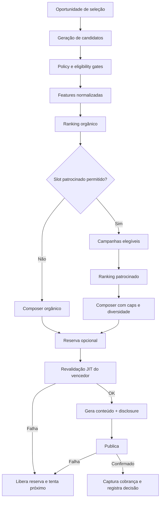

# Especificação do seletor de ofertas e campanhas patrocinadas

**Data:** 24 de julho de 2026
**Complemento de:** [Plano de viabilidade e evolução do Spreading](PLANO_SAAS_VIABILIDADE.md)

---

## 1. Resposta curta

O seletor deve ser reconstruído como cinco etapas independentes:

```text
1. Elegibilidade e política
        ↓
2. Qualidade/relevância orgânica
        ↓
3. Decisão: esta oportunidade admite patrocinado?
        ↓
4. Ranking apenas entre campanhas patrocinadas elegíveis
        ↓
5. Composição, revalidação, publicação e cobrança
```

A loja **não compra o primeiro lugar geral**. Ela paga para participar de um espaço patrocinado limitado, destinado apenas a creators compatíveis que aceitaram receber campanhas. O dinheiro nunca pode liberar:

- oferta sem estoque;
- preço ou desconto enganoso;
- seller diferente daquele que paga;
- link sem atribuição válida;
- categoria proibida;
- canal incompatível com as regras;
- creator que não consentiu;
- repetição excessiva;
- conteúdo sem identificação publicitária.

No estágio inicial, o Spreading não possui audiência consumidora própria. Portanto, a loja não compra “impressões no aplicativo”: ela compra **descoberta junto a creators** e, quando o creator aceita, uma **publicação patrocinada confirmada**. CPM e CPC não são modelos adequados para o começo.

Regra de produto:

> **A loja paga para competir dentro da faixa patrocinada; não paga para remover os controles de qualidade nem para tomar o canal do creator.**

---

## 2. Como o seletor funciona hoje

Existem três caminhos de ordenação que podem divergir: a tela manual e duas pontuações sucessivas no fluxo automático.

### 2.1 Tela manual “Top Promoções”

A tela em [`views.py`](python/django/apps/scrapers/views.py#L1396):

- filtra por marketplace, categoria, busca, desconto, fonte e confiança;
- ordena produtos principalmente por percentual de desconto ou economia em reais;
- ordena cupons por outra fórmula em [`coupon_rules.py`](python/django/apps/scrapers/coupon_rules.py#L245);
- mostra link afiliado, confiança, preço e alguns motivos;
- não usa integralmente o ranking da automação.

Consequência: a oferta nº 1 vista pelo creator pode não ser a oferta escolhida pelo envio automático.

### 2.2 Primeira pontuação automática

[`selecionar_item_para_grupo`](python/django/apps/scrapers/ofertas.py#L244) aplica:

- estado e validade;
- tenant;
- marketplace, categoria e termos;
- desconto mínimo e máximo;
- preço positivo;
- condição de cupom;
- cooldown por destino;
- histórico de preço;
- verificação de disponibilidade.

Pontuação simplificada atual:

```text
base = desconto_percentual × 2 + economia_em_reais ÷ 20

ajustes:
  confiança alta            × 1,15
  confiança baixa           × 0,75
  ticket abaixo de R$ 30    + 20
  cupom recente             × 1,50
  produto com cupom         × 1,20
  oferta relâmpago          × 1,40
  mínima de 30 dias         × 1,60
  cliques/publicação        + até 60
```

Essa etapa seleciona um pool pequeno e realiza chamadas de disponibilidade.

### 2.3 Segunda pontuação automática

[`content_ranking.py`](python/django/apps/scrapers/content_ranking.py#L1) recebe esse pool e pontua novamente:

- desconto, agora normalizado até 40 pontos;
- urgência até 20;
- confiança até 15;
- frescor até 10;
- cliques por publicação até 10;
- presença/estado da fonte até 5.

Produtos e cupons são unidos. Comissão é apenas desempate para cupons.

### 2.4 O que já é bom

- Os 14 testes direcionados de ranking/catálogo Awin passaram na auditoria de 24/07/2026.
- Filtros de validade, desconto e tenant.
- Cooldown por destino.
- Histórico de preço para reduzir desconto fictício.
- Confiança e proveniência.
- Revalidação antes do envio.
- Registro de `score` e `motivos_score` na publicação.
- Fallback para o próximo candidato em parte das falhas permanentes ou não classificadas; falha transitória e `precisa_login_ml` ainda abortam o ciclo.
- Testes de cooldown, mínima histórica e cupom incompatível.

### 2.5 Problemas que precisam ser resolvidos primeiro

| Problema | Efeito |
|---|---|
| Tela manual e automação usam ordenações distintas | Experiência e explicações contraditórias |
| Produto é pontuado duas vezes com fórmulas diferentes | Difícil entender e calibrar |
| Pool de produtos é cortado antes do ranking unificado | Um candidato bom pode nem chegar à comparação com cupons |
| Performance usa `produto_id` | Histórico se perde quando o item é recriado |
| Cliques brutos sem suavização e decaimento | Pouca amostra ou item antigo domina |
| Os novos envios usam link afiliado direto; o redirect rastreado atende links antigos | O sinal próprio de clique fica praticamente vazio; não se pode inventar CTR |
| Verificação de rede ocorre durante a seleção | Latência e custo crescem com o pool |
| Comissão só existe para alguns cupons | Comparação econômica desigual |
| Sem seller, estoque quantitativo, reputação ou buy-box | Não há garantia de que a loja anunciante receberá a venda |
| Sem diversidade por seller/categoria | Feed repetitivo |
| Sem versão e snapshot completos do algoritmo | Auditoria e A/B frágeis |
| Sem slot, budget ou consentimento patrocinado | Não é possível vender anúncios de forma segura |

### 2.6 Defeitos concretos a corrigir no v2

| Defeito atual | Correção |
|---|---|
| `horas_cooldown` é usado no seletor, mas o envio aplica proteção fixa de 24 horas | Uma única regra de cooldown, baseada em chave canônica, canal e destino |
| Performance usa cliques antigos porque novas publicações usam link direto | Tratar performance como ausente até existir evento permitido/oficial; nunca preencher com estimativa fictícia |
| Clique entra no primeiro e no segundo ranking | Um único componente suavizado |
| A prévia de “melhor conteúdo” consulta apenas cupons, não os ordena pelo score final e ignora produtos | A prévia chama o mesmo `SelectorService` em modo read-only |
| `_stats_preco` e `_performance` geram N+1 | Usar `stats_em_lote`, agregação por pool e cache |
| `is_alive()` faz rede durante a ordenação | Snapshot com TTL em background; JIT apenas no vencedor/top N |
| Fonte bloqueada pode continuar elegível com pequena penalidade | Fonte `blocked/disabled` vira hard reject |
| Cupom fixo é pontuado sem percentual efetivo, preço ou compra mínima | Converter benefício em valor efetivo por produto/checkout |
| Três raspagens iguais podem alterar artificialmente a mediana | Consolidar observações por janela/dia, tratar outlier e guardar referência pré-oferta |
| Worker consulta configurações vencidas sem lease | Lease/idempotency key e lock para uma execução por config |
| “Enviar agora” não atualiza o próximo agendamento | Recalcular `proximo_envio` após publicação manual |
| Código legado de seleção permanece divergente | Remover ou isolar depois de comprovar zero chamadores |

### Decisão

Antes de inserir qualquer campanha paga:

1. criar um único serviço de ranking;
2. usar a mesma pontuação na tela e na automação;
3. separar filtro duro de score;
4. registrar toda decisão;
5. executar a versão nova em shadow mode;
6. só depois ativar slots patrocinados.

---

## 3. Três produtos comerciais diferentes

### 3.1 Vitrine de oportunidades

A loja paga uma assinatura ou taxa de campanha para aparecer em uma área como “Oportunidades patrocinadas” para creators compatíveis.

O creator vê:

- loja e produto;
- marketplace;
- recompensa;
- comissão oficial disponível;
- período;
- briefing;
- entregáveis;
- restrições;
- nível de atribuição;
- direito de uso do conteúdo.

Ele aceita ou rejeita. Isso é descoberta B2B; não é impressão ao consumidor.

### 3.2 Publicação patrocinada

Depois do aceite:

- o creator aprova o conteúdo, ou habilita regras automáticas;
- o sistema reserva o orçamento;
- revalida oferta e link;
- publica com disclosure;
- obtém prova de entrega aceita pela política daquele canal;
- captura o valor por publicação.

A loja compra uma entrega comprovável, não a lista de membros, o grupo ou os dados da audiência.

### 3.3 Campanha de performance

Somente quando existir atribuição oficial A3:

- marketplace/rede devolve identificador que liga venda ao creator/campanha;
- venda passa por pendência, aprovação e janela de devolução;
- comissão ou fee de performance é calculado;
- cancelamento gera reversão.

Não habilitar performance apenas porque o seller autorizou acesso aos pedidos. Pedido do seller sem origem comprovada não é conversão do creator.

---

## 4. Arquitetura lógica do seletor

O fluxo abaixo representa fee fixo/CPP; CPS possui liquidação separada por conversão.



### 4.1 Geração de candidatos

Trazer pool amplo, por exemplo 100–300 itens elegíveis por SQL, sem verificar rede item a item.

Unificar produto e cupom em um DTO:

```text
OfferCandidate
  kind
  canonical_offer_key
  marketplace
  listing_external_id
  seller_external_id
  product/coupon reference
  title/category/macro
  current/reference/final price
  real_discount/savings
  stock and shipping
  seller reputation
  source/confidence/freshness
  official commission
  affiliate/link policy
  campaign, if sponsored
```

Não é obrigatório persistir esse DTO; ele pode ser montado pelo serviço. IDs canônicos, seller e evidências precisam existir no banco.

### 4.2 Eligibility gates

Gates são booleanos. Nenhum pagamento altera o resultado.

| Gate | Orgânico | Patrocinado | Falha |
|---|---:|---:|---|
| Tenant pode acessar a oferta | obrigatório | obrigatório | rejeita |
| Fonte/API permitida | obrigatório | obrigatório | rejeita |
| Marketplace × canal permitido | obrigatório | obrigatório | rejeita |
| Produto/categoria permitido | obrigatório | obrigatório | rejeita |
| Oferta ativa e dentro da validade | obrigatório | obrigatório | rejeita |
| Preço e estoque dentro do TTL | obrigatório | mais estrito | pausa |
| Desconto/claim possui evidência | para alegar desconto | obrigatório | remove claim/rejeita |
| Link oficial e atribuível ao creator | obrigatório para publicar | obrigatório | rejeita |
| Cooldown do produto/destino | obrigatório | obrigatório | rejeita |
| Reputação e experiência mínimas | recomendável | obrigatório | rejeita |
| Seller anunciante é o seller da oferta | não aplicável | obrigatório | rejeita |
| Link preserva/identifica o seller | não aplicável | obrigatório | rejeita |
| Campanha, saldo e período válidos | não aplicável | obrigatório | rejeita |
| Creator aceitou oportunidades | não aplicável | obrigatório | rejeita |
| Creator habilitou auto-publicação | não aplicável | para automático | envia para aprovação |
| Frequência patrocinada disponível | não aplicável | obrigatório | aguarda próximo slot |
| Criativo e disclosure aprovados | não aplicável | obrigatório | rejeita |

### Regras de preço

- Usar preço mediano e mínimo históricos do próprio item quando houver amostra suficiente.
- Não chamar `preco_sem_desconto` de preço real sem evidência.
- Quando não houver histórico, mostrar apenas preço atual ou limitar a confiança do claim.
- Para patrocinado, exigir evidência mais recente e piso de confiança.
- Pausar automaticamente se preço final, cupom, frete ou seller mudar além da tolerância.

### Buy-box e seller

Uma campanha de loja precisa apontar para uma oferta específica:

```text
marketplace + listing_id + seller_id
```

Se a página de catálogo puder direcionar a compra a outro seller e a conversão não informar quem vendeu:

- a oportunidade pode continuar orgânica;
- não pode integrar uma `CampaignOffer` patrocinada daquela loja;
- não pode ser cobrada por entrega nem por performance como anúncio daquele SKU/seller.

Uma futura campanha institucional de marca, sem promessa de venda para um seller ou SKU específico, seria outro produto comercial: fee fixo de ativação com creator, disclosure e métricas de conteúdo. Ela fica fora do MVP e nunca deve ser apresentada como campanha de performance da loja.

---

## 5. Score orgânico v2

Todos os componentes são normalizados entre 0 e 1. Separar qualidade para a audiência de utilidade econômica do creator evita que dinheiro patrocinado contamine o piso de qualidade.

```text
C =
    (35% valor real para o consumidor
   + 20% afinidade com creator e destino
   + 15% confiança e disponibilidade
   + 10% desempenho previsto
   + 10% novidade e urgência)
    ÷ 90%

U_orgânico = retorno afiliado orgânico esperado para o creator

Q_orgânico = 90% C + 10% U_orgânico

organic_score = round(Q_orgânico × 100 − penalidades)
```

`C` é a qualidade/relevância independente de remuneração da campanha. `U_orgânico` contém apenas a economia afiliada normal da oferta. Os pesos são hipótese inicial e devem ser versionados.

### 5.1 Valor real — 35%

Considera:

- queda versus mediana histórica;
- proximidade da mínima real;
- economia em reais normalizada pela categoria/ticket;
- preço final;
- condição e valor mínimo de cupom;
- frete;
- comparação cross-marketplace quando permitida;
- validade do desconto.

O desconto apresentado pelo seller não pode ser o único sinal.

### 5.2 Afinidade — 20%

- categoria e subnicho declarados pelo creator;
- termos positivos e negativos;
- marketplace aceito;
- faixa de preço;
- canal e formato;
- histórico do segmento naquele destino;
- bloqueios explícitos de marca/seller.

O creator controla a audiência; afinidade não deve ser inferida apenas por clique.

### 5.3 Confiança e disponibilidade — 15%

- fonte oficial/licenciada;
- idade do preço e estoque;
- link confirmado;
- confiança da oferta;
- reputação do seller;
- entrega/frete;
- estabilidade recente da oferta;
- seller preservado.

### 5.4 Desempenho previsto — 10%

Não usar simplesmente “cliques acumulados ÷ posts”.

Usar média suavizada por segmento:

```text
taxa_estimada =
    (eventos_qualificados + eventos_prior)
    ÷ (publicações + publicações_prior)
```

Ou, de forma equivalente:

```text
peso_amostra = n ÷ (n + 20)

performance =
    peso_amostra × performance_observada
  + (1 − peso_amostra) × prior_do_segmento
```

Segmento inicial:

```text
marketplace × macro_categoria × canal
```

Requisitos:

- decaimento temporal;
- eventos A3 valem mais que cliques;
- bots e eventos suspeitos não contam;
- item novo recebe prior neutro, não zero;
- usar chave canônica, não `Produto.id`;
- se a política proíbe tracking intermediário, deixar o sinal ausente ou usar relatório oficial.
- manter estatísticas orgânicas e patrocinadas separadas;
- evento obtido com distribuição paga não aumenta diretamente o ranking orgânico;
- registrar probabilidade/posição de seleção e usar exploração ou holdout para reduzir viés de exposição.

### 5.5 Novidade e urgência — 10%

- oferta recém-observada;
- queda real recente;
- campanha que termina em breve;
- diversidade versus últimas publicações;
- pequena exploração de item novo.

Urgência sem validade comprovada não recebe boost.

### 5.6 Retorno esperado do creator — 10%

- comissão afiliada orgânica/oficial;
- EPC oficial, quando disponível;
- probabilidade de aprovação/estorno.

A remuneração importa, mas não pode superar valor e confiança. Hoje a comissão é desempate de alguns cupons; no v2 ela entra de forma limitada e comparável. **Fee, bônus ou recompensa da campanha patrocinada não entram em `C`, `U_orgânico` nem `Q_orgânico`**: só podem influenciar uma vez a ordenação dentro da lane patrocinada, depois de a oferta superar o piso de qualidade `C`.

### 5.7 Penalidades e caps

- mesmo seller recentemente: `−10` a `−20`;
- categoria repetida em sequência: `−5` a `−10`;
- campanha com reclamações: pausa ou hard reject;
- confiança incompleta: cap de score;
- dado restrito incompatível com canal: hard reject;
- mesmo produto dentro do cooldown: hard reject;
- preço pior que publicação anterior sem nova vantagem: hard reject.

### 5.8 Diversidade

O ranking devolve uma lista; um `slate composer` monta a sequência final.

Ele evita:

- cinco produtos da mesma loja;
- cinco itens da mesma categoria;
- um marketplace dominar sempre;
- somente itens antigos com mais histórico;
- a mesma faixa de preço em todo o feed.

Reservar inicialmente 5%–10% das oportunidades orgânicas elegíveis para exploração controlada de itens novos, sem reduzir os gates de qualidade.

---

## 6. Como o patrocínio entra

### 6.1 Primeiro decide o slot

Não somar dinheiro ao score de todas as ofertas.

O `slot_policy` consulta o histórico do creator/destino:

```text
se creator não aceitou patrocínio:
    slot orgânico

se limite da janela móvel foi atingido:
    slot orgânico

se última publicação foi patrocinada:
    slot orgânico

se existe campanha elegível, orçamento e não é holdout:
    calcular probabilidade de serving pelo pacing

se sorteio determinístico < probabilidade de serving:
    slot patrocinado

caso contrário:
    slot orgânico
```

O cap é teto, não quota. Mesmo abaixo de 20%, o sistema pode escolher “sem anúncio” por pacing, holdout, baixa qualidade ou pouca demanda. Se não existir patrocinado bom, a vaga volta ao orgânico; não existe obrigação de preencher.

### 6.2 Defaults iniciais

Sempre redutíveis pelo creator:

- máximo de 20% patrocinado em janela móvel de 20 publicações;
- nunca dois patrocinados consecutivos;
- canal de baixo volume: no máximo um por dia;
- mesma loja: no máximo uma vez por destino em 24 horas;
- mesma loja: no máximo duas vezes por semana e destino;
- mesmo produto: uma vez a cada sete dias;
- exceção de produto somente após queda real de preço de pelo menos 10%;
- cap adicional por categoria;
- diversidade entre sellers, SKUs e marketplaces.

Na tela manual, mostrar no máximo dois cards patrocinados a cada dez resultados, sempre identificados.

São parâmetros iniciais, não regras eternas.

### 6.3 Consentimentos separados

1. **“Quero receber oportunidades patrocinadas no painel.”**
2. **“Permito publicação patrocinada automática neste destino.”**

Preferências por creator/canal:

- categorias aceitas;
- sellers permitidos/bloqueados;
- marketplaces;
- remuneração mínima;
- percentual patrocinado máximo;
- aprovação manual/automática;
- frequency cap;
- categorias proibidas;
- formatos;
- direito de reutilização de conteúdo.

A primeira campanha deve exigir aprovação manual. Auto-publicação começa desligada. A preferência global, sozinha, não autoriza campanhas futuras: cada entrega automática precisa apontar para um aceite específico da campanha ou para um mandato permanente versionado.

Esse aceite/mandato registra:

- seller, campanha e SKUs ou escopo permitido;
- recompensa e regra de pagamento;
- briefing, formatos e claims;
- canal, destino, frequência e período;
- versão dos termos;
- consentimento separado para reutilização do conteúdo, com mídia, território e prazo.

Troca material de seller, SKU, remuneração, criativo, canal ou direitos exige novo aceite. Revogação bloqueia imediatamente toda entrega ainda não publicada e libera sua reserva.

### 6.4 Ranking patrocinado no MVP

Sem leilão. Todos entram por preço/taxa comercial previamente definidos.

```text
sponsored_score_mvp =
    70% qualidade para a audiência C
  + 20% fit exato campanha–creator
  + 10% utilidade patrocinada normalizada para o creator
```

O pacing decide **se** uma campanha deve ser servida naquele momento; não dá pontos para ela vencer o ranking. A utilidade patrocinada considera a proposta recebida pelo creator, uma única vez e com cap — nunca o tamanho do orçamento nem um bid bruto da plataforma.

Requisitos sugeridos:

- `C × 100 >= 60`;
- confiança/freshness `>= 75`;
- creator opt-in;
- todos os gates aprovados.

O orçamento não compra pontos; ele torna a campanha disponível e controla entrega.

### 6.5 Ranking patrocinado com maior liquidez

Somente depois de haver concorrência real:

```text
sponsored_score =
    75% qualidade para a audiência C
  + 20% utilidade creator–campanha normalizada
  +  5% exploração

rank_score =
    sponsored_score
  × diversidade
  × fadiga

eligible_now =
    sorteio_determinístico < probabilidade_de_servir_do_pacing
```

O pacing atua como gate probabilístico antes da ordenação dos sobreviventes; não multiplica o score.

A utilidade creator–campanha pode representar recompensa do creator e adequação do contrato, mas:

- influencia no máximo cerca de 20%;
- nunca atua fora da lane patrocinada;
- não supera o piso de qualidade;
- passa por transformação logarítmica/percentil;
- aparece uma única vez no cálculo;
- não é o orçamento nem o valor bruto pago à plataforma.

Um leilão só faz sentido quando ao menos três campanhas financiadas competirem com frequência no mesmo nicho. Até lá, aumenta complexidade sem melhorar o mercado.

### 6.6 Disclosure

Bloqueado no template e persistido:

```text
Publicidade — oferta patrocinada por Loja X.

Este conteúdo contém link de afiliado. O creator pode receber
comissão se você comprar pelo link.
```

Regras:

- identificação desde o início;
- seller claramente nomeado;
- “Loja X no Mercado Livre”, sem sugerir patrocínio do próprio ML;
- não chamar de “melhor oferta” sem comparação objetiva;
- disclosure não removível em auto-publicação;
- versão publicada guardada no arquivo da campanha.

Fontes: [CDC](https://www.planalto.gov.br/ccivil_03/leis/l8078compilado.htm), [Código CONAR](https://www.conar.org.br/codigo/codigo.php) e [guia CONAR para influenciadores](https://www.conar.org.br/pdf/conar221.pdf).

---

## 7. Orçamento, pacing e cobrança

### 7.1 O que cobrar primeiro

| Modelo | Quando | Recomendação |
|---|---|---|
| Assinatura/taxa de campanha | Vitrine B2B | Sim |
| Por publicação confirmada | Canal com confirmação confiável | Sim, depois do piloto |
| Fee fixo para creator | Contrato e entrega aprovada | Sim, com fluxo fiscal |
| Venda aprovada/CPS | Atribuição oficial A3 | Depois |
| CPC | Clique qualificado + antifraude | Não no início |
| CPM | Audiência/impressão comprovada | Não no estágio atual |

Uma mensagem enviada não prova impressão. `CliquePublicacao` atual não deduplica pessoa/bot e não sustenta CPC.

### 7.2 Campos de campanha

- orçamento total;
- limite diário;
- limite por creator e destino;
- recompensa do creator;
- taxa da plataforma;
- valor máximo por evento;
- início, fim e fuso;
- modelo de cobrança;
- reserva de estorno;
- objetivo;
- targeting;
- forecast em intervalo.

### 7.3 Ciclo financeiro

Para fee fixo ou CPP:

```text
creator aceita / slot é autorizado
        ↓
reserva atômica do valor da entrega
        ↓
revalidação JIT
        ├── falha → libera reserva
        ↓
tentativa de publicação idempotente
        ├── falha → libera reserva
        ├── estado incerto → mantém em reconciliação, sem repetir
        ↓
prova de entrega aceita para aquele canal
        ├── válida → captura uma vez
        └── ausente/disputada → revisão, liberação ou estorno
```

“Publicação confirmada” precisa de política por canal:

- API oficial: `message_id` do provedor, status terminal aceito e chave idempotente;
- automação por navegador: enquanto não houver prova robusta, reconciliação manual; sucesso no DOM não gera cobrança automática;
- exportação/publicação manual: gerar a peça não cobra; o creator envia URL/evidência e a operação valida;
- cada política define permanência mínima, remoção, edição, prazo de contestação e evidências aceitas.

Uma confirmação de aceite da API não prova impressão nem permanência.

Para CPS, **não reservar um valor por publicação**. Uma publicação pode gerar zero, uma ou várias vendas dias depois:

- no início, a rede/marketplace liquida a comissão afiliada e o Spreading apenas reconcilia o evento A3;
- se o Spreading futuramente garantir recompensa CPS, a campanha deve ser pré-financiada;
- cada conversão usa `order/event_id` único e captura atômica própria;
- os termos definem janela de atribuição, vendas após pausa/fim do budget e reserva para cancelamento;
- o fechamento mantém provisão para conversões tardias e estornos;
- nenhuma recompensa pode ser prometida sem saldo pré-financiado ou autorização contratual de complemento.

Implementação:

- valores em centavos/decimal, nunca `float`;
- Postgres transaction + `select_for_update`;
- idempotency key única;
- ledger imutável;
- reservas com expiração;
- nenhuma captura duplicada em retry;
- gasto nunca pode ultrapassar saldo.

### 7.4 Pacing

No cold start:

- dividir orçamento por dia/hora;
- limitar gasto rigidamente;
- priorizar campanha atrasada sem ultrapassar os caps de qualidade.

Depois:

```text
entregas_restantes =
    saldo_restante
    ÷ custo_esperado_por_entrega

probabilidade_de_servir =
    min(1,
        entregas_restantes
        ÷ oportunidades_elegíveis_restantes_estimadas)
```

Pacing pode usar um multiplicador limitado para ajustar a **probabilidade de serving**, sem resgatar oferta ruim nem alterar o ranking. Overdelivery financeiro deve ser zero. Uma entrega operacional além do contratado só pode ser gratuita para o seller ou previamente autorizada e financiada.

O forecast para o seller deve ser intervalo:

```text
“Estimativa: 15–28 publicações elegíveis”
```

Não prometer alcance exato.

### 7.5 Recompensa e split

- comissão de marketplace continua paga pelo marketplace/rede;
- recompensa fixa é relação separada;
- taxa da plataforma é explícita;
- não fazer spread oculto;
- PSP/split precisa suportar a operação;
- split de checkout próprio não divide venda realizada dentro do marketplace.

---

## 8. Modelos de dados

Esses modelos entram depois de `Organization` e `Membership`.

### `StoreAccount`

- organização seller;
- marketplace;
- external seller ID;
- OAuth status/scopes;
- verificação/KYC;
- reputação;
- status;
- última sincronização.

### `Campaign`

- seller organization;
- nome, objetivo e status;
- marketplace;
- `billing_model`;
- início/fim/fuso;
- orçamento total e diário;
- targeting;
- taxa/recompensa;
- disclosure;
- termos/versões aprovados;
- attribution level requerido.

Estados:

```text
draft → review → approved → active → paused → ended → reconciled
```

### `CampaignOffer`

- campanha;
- produto/listing;
- canonical offer key;
- listing e seller externos;
- prova de propriedade;
- preço máximo;
- desconto/claim permitido;
- estoque mínimo;
- comissão base/extra;
- briefing/criativo;
- policy status;
- quality floor;
- última validação.

### `CreatorAdPreference`

- creator/organization;
- oportunidades habilitadas;
- auto-publicação por destino;
- share máximo;
- categorias/sellers permitidos e bloqueados;
- recompensa mínima;
- aprovação obrigatória;
- preferências de direitos de conteúdo, sem substituir consentimento contratual específico.

### `CampaignInvitation`

- creator;
- campanha/oferta;
- status de convite;
- proposta/recompensa;
- motivo de rejeição.

### `CampaignAcceptance`

- creator e campanha;
- versão do mandato/termos;
- seller e SKUs/escopo autorizados;
- recompensa, canal, frequência e período;
- estado ativo/revogado/expirado;
- consentimento de reutilização separado;
- timestamps e prova do aceite.

Uma alteração material cria nova versão. Um aceite pode autorizar várias entregas, mas cada entrega referencia exatamente a versão que a permitiu.

### `CampaignCardView`

- creator, campanha/oferta e superfície;
- `served_at` e `viewed_at`;
- posição e selection run;
- chave de deduplicação.

Um convite pode ser servido e visto várias vezes; essas ocorrências não pertencem ao ciclo financeiro de uma publicação.

### `SelectionRun`

- creator/config/destino;
- timestamp;
- slot type;
- algorithm version;
- feature flag/experimento;
- seed;
- policy snapshot.

### `SelectionCandidate`

- run;
- oferta;
- campaign offer opcional;
- elegível;
- motivo da rejeição;
- features;
- organic/sponsored score;
- posição.

Persistir o top N, o vencedor e todos os patrocinados selecionados/rejeitados por gate. Em escala, os demais rejeitados podem ir para event storage com retenção limitada, não necessariamente uma linha eterna no Postgres.

Separar:

- `served_at`: o servidor incluiu o card na resposta;
- `viewed_at`: um beacon de viewport informou visualização.

Nenhum dos dois deve gerar CPC no MVP.

### `CampaignDelivery`

- campanha/oferta/creator/destino;
- aceite/mandato versionado;
- selection run;
- publicação e tentativa idempotente;
- estados `authorized`, `reserved`, `publish_attempted`, `published`, `verified`, `charged`, `released`, `reversed`, `disputed`;
- timestamps;
- valores financeiros;
- disclosure;
- `message_id` e prova externa conforme política do canal.

Cada `CampaignDelivery` representa uma entrega/publicação, não o card nem o aceite. Um mesmo aceite pode gerar várias deliveries dentro dos caps.

### `BudgetLedgerEntry`

- campanha;
- delivery opcional para CPP;
- evento/conversão opcional para CPS;
- `reserve`, `capture`, `release`, `refund`, `adjustment`;
- valor;
- moeda;
- idempotency key;
- evento de origem;
- timestamp.

`EventoOperacional` continua sendo log de diagnóstico/suporte. Não substitui `CampaignAcceptance`, prova de publicação nem ledger financeiro imutável.

### Extensões de `Publicacao`

- `placement_type`: organic, sponsored, exploration;
- `campaign_id`;
- `seller_id`;
- `selection_run_id`;
- `algorithm_version`;
- `organic_score`;
- `sponsored_score`;
- `billing_model`;
- snapshots de valor/recompensa/taxa;
- disclosure/version;
- data freshness;
- canonical offer key.

---

## 9. Serviço de ranking

Estrutura sugerida dentro do monólito atual:

```text
apps/scrapers/selection/
  contracts.py
  candidate_query.py
  eligibility.py
  features.py
  organic_score.py
  sponsored_score.py
  blending.py
  decisions.py
  service.py
  versions/v2.py
```

Contrato:

```python
SelectionResult(
    selected,
    placement_type,
    score,
    reasons,
    alternatives,
    policy_snapshot,
    algorithm_version,
)
```

### Princípios

- função determinística para mesmos dados, horário e seed;
- features puras e testáveis;
- nenhuma chamada de rede na pontuação de centenas de itens;
- background atualiza liveness/preço/estoque;
- JIT revalida somente os melhores;
- mesma API alimenta Top Promoções, preview e automação;
- durante a migração, `selecionar_conteudo_para_grupo`, `selecionar_item_para_grupo` e `top_promocoes` permanecem como wrappers dessa API;
- motivos vêm dos componentes reais;
- pesos e thresholds têm versão;
- rollback por feature flag.

Flags separadas:

```text
selector_v2_shadow
selector_v2_live
sponsored_discovery
sponsored_autopublish
performance_ranking
performance_billing
```

Não reutilizar controles de processo da automação como feature flags de produto.

### Pseudocódigo

```python
def select_offer(context):
    run = start_run(context, algorithm="v2")

    raw = generate_candidates(context, pool_size=200)
    eligible, rejected = apply_policy_gates(raw, context)
    scored = score_organic(eligible, context)

    slot = slot_policy(context, recent_publications())
    if slot == "sponsored":
        ads = sponsored_candidates(scored, context)
        ads = apply_campaign_gates(ads, context)
        ranked = score_sponsored(ads, context)
        slate = compose_sponsored(ranked, scored)
    else:
        slate = compose_organic(scored)

    for candidate in slate:
        reservation = reserve_if_needed(candidate)
        if not revalidate_jit(candidate):
            release(reservation)
            record_rejection(candidate, "jit_failed")
            continue
        record_winner(run, candidate)
        return candidate, reservation

    return no_candidate()
```

Publicação e cobrança continuam fora da função de ranking; recebem `candidate` e `reservation` de forma idempotente.

---

## 10. Experiência das telas

### 10.1 Creator — “Para você”

Tabs:

- Recomendadas;
- Oportunidades patrocinadas;
- Cupons;
- Histórico.

Card orgânico:

- preço atual e referência confiável;
- desconto real;
- seller/marketplace;
- estoque/freshness;
- frete;
- comissão;
- “Por que recomendamos”;
- nível de atribuição.

Card patrocinado:

- badge **Patrocinado**;
- nome do seller;
- recompensa fixa;
- comissão oficial separada;
- entregáveis;
- prazo;
- nível de medição;
- “Por que você recebeu”;
- aceitar, rejeitar, bloquear seller;
- nenhum claim de ganho garantido.

### 10.2 Preferências do creator

- receber oportunidades;
- auto-publicação desligada por padrão;
- limite patrocinado;
- categorias e sellers;
- recompensa mínima;
- aprovação;
- direitos de UGC;
- frequência.

### 10.3 Seller

- conta verificada;
- catálogo/listing exato;
- nova campanha;
- budget e pacing;
- creators elegíveis/convidados/aceitos;
- publicações confirmadas;
- vendas A3 pendentes/aprovadas/revertidas;
- spend;
- forecast em intervalo;
- motivos de rejeição;
- sem dados pessoais da audiência.

### 10.4 Admin/compliance

- verificação da loja;
- ownership do SKU;
- claims e evidências;
- categorias proibidas;
- preview do conteúdo/disclosure;
- arquivo da campanha;
- denúncias;
- pausas e decisões.

### 10.5 Conteúdo enviado

A identificação patrocinada deve fazer parte do payload aprovado. Em exportação manual, o sistema orienta e registra o conteúdo, mas não pode afirmar que foi publicado até receber confirmação confiável.

---

## 11. Antifraude e abuso

### Seller/anunciante

- KYC e propriedade da conta/SKU.
- Histórico de preço contra falso desconto.
- Hash/snapshot da página e criativo aprovado.
- Pausa por troca de seller, preço, produto ou link.
- Limites pequenos para anunciante novo.
- Categorias e claims moderados.
- Detecção de duplicatas.
- Penalidade por reclamação, cancelamento e divergência.

### Creator

- publicação confirmada por integração quando possível.
- Print não é única prova.
- ID de decisão e link oficial.
- Deduplicação de pedido/conversão.
- Clique suspeito não conta.
- Reward pendente durante janela de cancelamento quando o modelo for CPS.
- Auditoria de remoção do disclosure.
- Probation e limites para conta nova.

### Plataforma

- transações e idempotência;
- segregação por tenant;
- nenhuma campanha pode gastar saldo de outra;
- nenhum seller acessa dados de outro;
- revisão de alteração após aprovação;
- log de decisão;
- kill switch por marketplace/canal/campanha;
- reconciliação diária do ledger.

### Sinais de alerta

- preço sobe logo após a aprovação;
- oferta troca de seller;
- CTR impossível;
- creator e seller com relação suspeita;
- várias contas divulgando para o mesmo destino;
- conversões duplicadas;
- taxa de devolução anormal;
- disclosure removido;
- campanha concentra toda a distribuição.

---

## 12. Métricas e experimentos

### Funil correto

```text
oportunidade de seleção
→ candidato elegível
→ card mostrado ao creator
→ campanha aceita
→ publicação tentada
→ publicação confirmada
→ clique qualificado, se permitido
→ venda atribuída
→ venda aprovada
→ reward pago
```

Não chamar publicação de impressão.

### Creator

- taxa de aceite/rejeição;
- motivo de rejeição;
- recompensa por publicação;
- receita total versus perda orgânica;
- limite patrocinado escolhido;
- retenção;
- reclamações/bloqueios;
- sellers bloqueados.

### Seller

- creators elegíveis, alcançados e ativos;
- tempo até primeira publicação;
- fill rate;
- publicações confirmadas;
- custo por publicação;
- conversão/venda A3;
- reversões;
- repetição de campanha.

### Qualidade do seletor

- oferta válida na hora da publicação;
- diferença de qualidade orgânica versus patrocinada;
- freshness;
- diversidade por seller/categoria;
- cobertura de explicação;
- taxa de fallback JIT;
- concentração de exposição;
- performance do v2 versus v1.

### Orçamento

- gasto versus pacing;
- reservas expiradas;
- captura duplicada;
- overdelivery;
- reconciliação;
- saldo negativo, que deve ser zero.

### Incrementalidade

Definir tratamento e controle por unidade determinística:

```text
campaign_id + creator + destino
```

A alocação permanece estável durante toda a campanha, sua janela de atribuição e um washout definido; alternar por semana causa carryover. O tamanho do holdout vem de cálculo de poder/amostra — `5%–10%` pode ser ponto de partida operacional, não regra fixa.

Tratamento pode receber patrocinado; controle recebe a melhor oferta orgânica. No controle, registrar em shadow qual anúncio teria vencido e medir efeitos sobre o resultado total do creator/destino:

Comparar:

- cliques/publicação;
- comissão e GMV A3;
- receita total do creator;
- reclamações;
- retenção;
- qualidade da oferta.

O GMV A3 do link de campanha será zero no controle por construção; isso mede atribuição, não lift de vendas do seller. Incrementalidade do seller exige vendas totais da loja ou outro experimento randomizado com dados independentes da exposição. Sem isso, chamar “venda atribuída”, não “venda incremental”.

---

## 13. Testes obrigatórios

### Ranking

- mesma entrada/seed gera mesma ordem;
- pesos somam corretamente;
- score respeita limites;
- item novo recebe prior, não zero;
- dado antigo perde peso;
- histórico canônico sobrevive à recriação do produto;
- produto e cupom usam escala comparável;
- cupom fixo usa desconto efetivo e compra mínima;
- fonte bloqueada/desabilitada nunca concorre;
- prévia e execução devolvem o mesmo vencedor para o mesmo contexto;
- diversidade funciona;
- performance patrocinada não aumenta diretamente o score orgânico;
- recompensa de campanha não entra em `C` nem é contada duas vezes;
- explicações correspondem às features.
- query count fica limitado por lote, não por candidato.

### Gates

- patrocínio nunca supera hard gate;
- seller errado é rejeitado;
- buy-box incerta bloqueia performance;
- preço/estoque stale pausa;
- categoria/canal proibido rejeita;
- creator sem opt-in nunca recebe patrocinado;
- auto-publicação desligada exige aceite;
- cada entrega referencia um aceite/mandato vigente e na versão correta;
- mudança material ou revogação impede futuras entregas;
- link sem afiliação válida rejeita;
- disclosure sempre aparece.

### Frequency e slate

- nunca dois patrocinados consecutivos;
- rolling cap respeitado;
- caps por seller/produto/categoria;
- creator pode escolher limite menor;
- abaixo do cap, pacing/holdout ainda pode escolher “sem anúncio”;
- ausência de anúncio bom preenche com orgânico;
- exploração nunca fura qualidade.

### Budget/ledger

- duas workers não gastam o último saldo;
- duas workers não executam a mesma configuração vencida;
- retry não captura duas vezes;
- falha libera reserva;
- timeout libera reserva;
- somente prova aceita para o canal captura uma vez;
- exportação gerada e sucesso incerto do navegador não capturam automaticamente;
- CPS captura por conversão idempotente, nunca por publicação;
- devolução cria reversão;
- total do ledger reconcilia;
- zero saldo negativo/overdelivery.

### Tenant e segurança

- seller não vê creator/campanha de outro tenant;
- creator não vê campanha não elegível;
- nenhuma preferência ou budget vaza;
- alteração de criativo exige nova aprovação.

### Rollout

- shadow v1/v2 registra divergência sem mudar publicação;
- feature flag por tenant/canal;
- kill switch imediato;
- rollback preserva ledger;
- score version aparece no audit log.
- publicação manual reage agenda e impede envio imediato no tick seguinte.

---

## 14. Roadmap de implementação

### Fase S0 — instrumentação e unificação, 1–2 semanas

- Extrair o serviço único v2 em modo shadow; o seletor v1 continua live até o gate.
- Criar DTO normalizado.
- Usar chave canônica.
- Registrar ranking run, features e versão.
- Retirar a dupla pontuação apenas no cálculo v2 shadow.
- Comparar a ordem de Top Promoções com o mesmo score v2, sem alterar ainda a resposta live.
- Corrigir prévia, cooldown e agendamento manual.
- Adicionar lease/idempotência por configuração.
- Não alterar vencedor em produção ainda.

**Gate:** shadow mode explica 100% do top 10 e não aumenta queries/latência de forma material.

### Fase S1 — orgânico v2, 3–5 semanas

- Features normalizadas.
- Priors e decaimento.
- Pool amplo.
- Liveness em background + JIT.
- Diversidade.
- A/B v1 versus v2.

**Gate:** menos de 1% de oferta inválida na publicação e melhoria de qualidade/aceite sem queda de retenção.

### Fase S2 — vitrine de campanhas, 4–6 semanas

- StoreAccount.
- Campaign/CampaignOffer.
- Começar somente com produtos cujo vínculo seller–listing seja comprovável; cupom genérico não demonstra benefício para a loja anunciante.
- Preferências e convites.
- KYC/review.
- Operação pelo Django Admin antes de construir portal seller.
- Cards patrocinados separados.
- Preço fixo, sem auto-publicação e sem ledger de performance.

**Gate:** creators aceitam voluntariamente e pelo menos dois sellers repetem campanha.

### Fase S3 — slot patrocinado controlado, 3–5 semanas

- Slot policy.
- Caps/frequência.
- Ranking patrocinado MVP.
- Contas internas, sem cobrança real.
- Disclosure.
- Holdout.

**Gate:** 100% disclosure, qualidade patrocinada próxima da orgânica e nenhuma piora material de retenção.

### Fase S4 — budget e cobrança por publicação, 4–8 semanas

- Ledger e reserva.
- PSP/billing.
- Idempotência.
- Confirmação de publicação.
- Dashboard seller.
- Reconciliação.

**Gate:** nenhum gasto acima do budget e reconciliação diária exata.

### Fase S5 — performance oficial

- Integração A3.
- Conversão pendente/aprovada/revertida.
- CPS/take rate permitido.
- Antifraude.
- Payout.
- Incrementalidade.

**Gate:** programa autoriza o modelo, venda liga oficialmente creator/campanha e estorno funciona.

### Estimativa

Com dois engenheiros experientes e design/operação fracionados:

- seletor orgânico confiável: 4–7 semanas;
- vitrine patrocinada manual: +4–6 semanas;
- slot e budget comercial: +7–13 semanas;
- performance: depende mais de parceria/API do que de código.

Não iniciar todas as fases juntas.

---

## 15. Exemplo prático

Quatro ofertas orgânicas:

| Oferta | `organic_score` |
|---|---:|
| Air fryer A | 82 |
| Cafeteira B | 76 |
| Monitor C | 71 |
| Aspirador D | 68 |

Duas lojas pagantes:

| Campanha | C | Fit | Utilidade creator | Resultado |
|---|---:|---:|---:|---|
| Seller X — Panela | 72 | 90 | 70 | `0,70×72 + 0,20×90 + 0,10×70 = 75,4` |
| Seller Y — Fone | 55 | 95 | 100 | Rejeitado: C abaixo de 60 |

Mesmo que Seller Y pague mais, o produto não entra.

Se o histórico permite o slot, o holdout não o bloqueia e o sorteio determinístico do pacing passa — por exemplo, `0,34 < probabilidade 0,60`:

```text
1. Air fryer A     — orgânico
2. Cafeteira B     — orgânico
3. Monitor C       — orgânico
4. Aspirador D      — orgânico
5. Panela Seller X — PATROCINADO
```

Antes do item 5, em uma campanha CPP:

1. reserva o valor;
2. confirma seller, preço, estoque e link;
3. gera disclosure;
4. publica;
5. captura após confirmação.

Em CPS, não existe reserva por publicação: a liquidação ocorre por conversão A3 idempotente, conforme as regras da seção financeira.

Se falhar:

- libera a reserva;
- registra o motivo;
- tenta o próximo patrocinado elegível;
- se não houver, envia o melhor orgânico.

---

## 16. Decisões finais

### Fazer

- um ranking orgânico único;
- hard gates antes do score;
- lane patrocinada separada;
- opt-in do creator;
- preço fixo no MVP;
- máximo inicial de 20%;
- qualidade mínima;
- disclosure bloqueado;
- cobrança por entrega confirmada;
- A3 antes de performance;
- ledger e auditoria;
- shadow mode e holdout.

### Não fazer

- vender “primeiro lugar”;
- misturar lance ao orgânico;
- auto-publicar por padrão;
- cobrar CPM sem impressão;
- cobrar CPC com clique atual;
- prometer ROI com pedidos sem origem;
- permitir que seller escolha qualquer listing;
- usar `Produto.id` como histórico permanente;
- chamar último clique de incrementalidade;
- construir leilão antes de existir liquidez.

### Definição comercial recomendada

> “A loja financia uma campanha para creators compatíveis. O Spreading valida a oferta, apresenta ou distribui a oportunidade dentro dos limites escolhidos pelo creator e cobra apenas pelo modelo acordado. Toda publicação é identificada e o pagamento nunca substitui os critérios de qualidade.”
