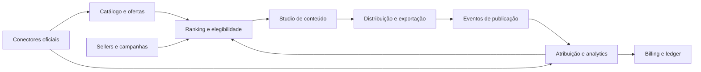

# Plano de viabilidade e evolução do Spreading

## De automação de ofertas a um SaaS de creator commerce

**Data da análise:** 24 de julho de 2026
**Escopo:** produto atual, mercado, concorrência, marketplaces, modelo de negócio, arquitetura, riscos, marca e roteiro de validação.

> Este documento é um estudo de produto e negócio, não um parecer jurídico, tributário ou de propriedade intelectual. Termos de plataformas mudam com frequência; as decisões de lançamento devem passar por nova conferência e, nas áreas indicadas, por assessoria especializada.

---

## 1. Resumo executivo

### Veredito

**A oportunidade é viável, com um “GO condicionado”.**

O produto não deve ser lançado como “um bot que raspa promoções e publica em grupos”, nem começar como um marketplace genérico que promete ligar qualquer marca a qualquer influenciador. A tese mais promissora é:

> **Um sistema operacional cross-marketplace para creators brasileiros de ofertas e sellers: encontrar o produto certo, usar o link oficial correto, criar conteúdo, distribuir e consolidar resultados verificáveis em um único fluxo.**

Há sinais fortes para a categoria, mas isso ainda não prova demanda pelo SaaS. Na pesquisa #Publi 2025, 8 em cada 10 brasileiros disseram já ter comprado algo recomendado por creators e, para 7 em cada 10, autenticidade é decisiva. O investimento brasileiro em publicidade digital chegou a R$ 37,9 bilhões em 2024 e retail media foi estimado em R$ 3,5 bilhões, 41% acima do ano anterior. Isso confirma comportamento de compra e orçamento anunciante relevantes; disposição a usar e pagar pelo Spreading ainda precisa ser validada. Fontes: [IAB Brasil — #Publi 2025](https://iabbrasil.com.br/pesquisa-publi-2025-identificacao-e-autenticidade-na-creator-economy/) e [IAB Digital AdSpend 2025, ano-base 2024](https://iabbrasil.com.br/wp-content/uploads/2025/04/IAB_Digital_Adspend_2025_anobase2024_AF.pdf).

Ao mesmo tempo, a ideia central já está validada — e parcialmente ocupada:

- O Mercado Livre já oferece **Venda com Afiliados/Ganhos Extras**, em que vendedores financiam comissão adicional.
- A Shopee já formaliza **MCNs**, campanhas de sellers, divisão de comissão com afiliados e atribuição oficial.
- TikTok Shop, Magalu, Amazon, Pelando e Promobit cobrem partes importantes da jornada.
- DivulgaNinja e Pro Afiliados/Afilira mostram que automação de ofertas para WhatsApp e Telegram já virou uma categoria de baixo preço.

A oportunidade defensável não é recriar cada programa. É ser a camada neutra que cada ecossistema fechado não tem incentivo para oferecer.

### Avaliação qualitativa

| Dimensão | Situação | Nota indicativa |
|---|---|---:|
| Dor do creator de ofertas | Frequente, operacional e mensurável | 4,5/5 |
| Demanda de sellers por creators/performance | Validada pelos programas nativos | 4/5 |
| Base técnica existente | Piloto funcional e bem testado | 3,5/5 |
| Diferenciação como “bot de ofertas” | Baixa | 1,5/5 |
| Diferenciação como OS cross-marketplace | Boa, se houver dados oficiais | 4/5 |
| Acesso atual a atribuição oficial | Desigual por marketplace | 2,5/5 |
| Escalabilidade da arquitetura atual | Baixa | 2/5 |
| Viabilidade de um marketplace bilateral já no lançamento | Baixa | 2/5 |
| Viabilidade de um SaaS creator-first | Média/alta | 4/5 |

As notas são uma síntese de decisão, não resultado estatístico.

### As cinco decisões estratégicas

1. **Evoluir o código existente; não reescrever.** Há ativos relevantes em catálogo, ranking, conectores, publicações, relatórios e operação.
2. **Começar creator-first.** Primeiro provar produtividade, recorrência e disposição a pagar. Sellers entram inicialmente em campanhas assistidas, não em marketplace aberto.
3. **Usar mecanismos oficiais.** API, OAuth, `subId`, etiqueta e relatório nativo sempre que existirem. Automação de navegador não pode ser a fundação comercial.
4. **Tratar Shopee/MCN como a melhor candidata a integração profunda inicial.** A estrutura oficial é a mais próxima da visão proposta, mas elegibilidade, aprovação e credenciais ainda não estão garantidas.
5. **Não vender “vendas e conversão” quando há apenas clique.** Toda métrica deve mostrar sua origem e seu nível de confiança.

### O que deve ser evitado

- Escalar o fluxo atual de Mercado Livre por Playwright como promessa central.
- Oferecer WhatsApp Web ilimitado como recurso padrão do plano.
- Cobrar por performance que não possa ser reconciliada oficialmente.
- Misturar resultado orgânico e patrocinado sem identificação.
- Custodiar comissão e pagar creators antes de resolver contratos, fiscal, KYC, estornos e ledger.
- Construir um marketplace aberto antes de ter creators retidos e campanhas suficientes.
- Usar “IA que cria Story” como principal diferencial; isso já é commodity.

---

## 2. A tese de produto recomendada

### Posicionamento

**Categoria inicial:** creator commerce / affiliate operations / descoberta patrocinada para sellers. “Retail media” só passa a ser uma descrição adequada se o produto adquirir inventário voltado ao consumidor e audiência própria relevante.

**Proposta principal:**

> “O painel cross-marketplace para creators de ofertas e lojistas brasileiros. Compare produtos e comissões, produza o conteúdo certo, publique com o link correto e acompanhe o resultado em um só lugar.”

### O que o produto é

- Um cockpit de operação para creator de ofertas.
- Um catálogo cross-marketplace normalizado.
- Um gerenciador de links, conteúdos, campanhas, canais e resultados.
- Uma ponte opt-in entre sellers e creators.
- Uma camada de transparência entre clique observado e venda confirmada.
- Um mecanismo de seleção com qualidade, relevância e patrocínio identificado.

### O que o produto não deve ser no início

- Uma nova rede de afiliação.
- Um substituto dos pagamentos e da atribuição dos marketplaces.
- Uma agência de grandes influenciadores.
- Um agregador de ofertas construído sobre scraping indiscriminado.
- Um disparador irrestrito de mensagens.
- Um editor gráfico genérico concorrendo frontalmente com Canva, Adobe ou ferramentas de IA.

### A vantagem que pode se tornar defensável

O moat não será o acesso a um modelo de IA nem um gerador de links. Será o conjunto de dados normalizados e históricos:

`produto × marketplace × preço × comissão × seller × creator × audiência × canal × horário × conteúdo × resultado validado`

Esse ativo é condicional. Dados recebidos de marketplaces podem ser confidenciais ou licenciados apenas para operar/medir uma campanha. Reutilização cross-tenant, treinamento de modelos, portabilidade ou redistribuição exigem permissão contratual, finalidade compatível, minimização e, quando aplicável, anonimização efetiva. O produto deve aprender apenas com dados que tenha direito de reutilizar.

Com tempo e volume suficientes, isso permite responder melhor do que os sistemas nativos:

- Qual produto deve ser divulgado agora?
- Em qual marketplace ele está mais competitivo?
- Qual creator tem público e histórico adequados?
- Que comissão torna a campanha atraente sem destruir a margem?
- Qual conteúdo e horário funcionam para aquele público?
- Quando pausar por preço, estoque, saturação ou risco?
- Qual conteúdo orgânico já provou conversão e merece ser impulsionado?

---

## 3. Diagnóstico do programa atual

### Maturidade encontrada

O sistema é um **piloto funcional acima do nível de protótipo**, mas ainda não é um SaaS self-service nem uma plataforma bilateral.

| Capacidade atual | Maturidade |
|---|---:|
| Automação para afiliados | 6/10 |
| SaaS multiusuário operado manualmente | 4/10 |
| SaaS self-service com cobrança | 2/10 |
| Plataforma seller–creator | 1/10 |

Fluxo atual simplificado:

```text
fontes de oferta
    → catálogo normalizado
    → regras e ranking
    → link afiliado por usuário
    → publicação WhatsApp/Telegram
    → histórico de publicação
    → importação agregada de receita
```

### Ativos que devem ser preservados

- Django, Postgres e a maior parte do domínio atual.
- Contrato extensível de marketplace em [`marketplaces/base.py`](python/django/apps/scrapers/marketplaces/base.py#L5).
- Registry de Mercado Livre, Amazon e Awin, já preparado conceitualmente para Shopee em [`marketplaces/registry.py`](python/django/apps/scrapers/marketplaces/registry.py#L6).
- Fontes plugáveis, persistência normalizada e circuit breaker.
- Catálogo com proveniência, confiança, validade, cupons e histórico de preço.
- Geração, cache e validação de link afiliado por usuário.
- Ranking por desconto, urgência, confiança, frescor e desempenho em [`content_ranking.py`](python/django/apps/scrapers/content_ranking.py#L41).
- Registro auditável de publicação, canal, conteúdo, preço, link e score em [`models.py`](python/django/apps/scrapers/models.py#L312).
- Branding por usuário, templates e geração textual por LLM.
- Cotas, suspensão, deduplicação, estados de conexão e recuperação de falha.
- Eventos operacionais, incidentes, health checks, staging e Sentry opcional.
- Awin e Amazon Creators API como exemplos de integração oficial.
- Telegram por API oficial.

### Qualidade verificada

Em 24/07/2026:

- **318/318 testes Django aprovados**.
- **121/121 testes Node aprovados**.
- Migrações sem alterações pendentes.
- `check --deploy` sem alerta na configuração de produção.
- Uma vulnerabilidade de severidade baixa no `npm audit`, com correção disponível.
- CI executa checks, migrações e testes.

Isso reduz risco de regressão na evolução, mas não resolve termos de plataforma, isolamento de tenant ou escala.

### Lacunas de domínio para a visão proposta

Hoje o tenant é diretamente um `User`. Ainda não existem:

- `Organization` e `Membership` para loja, agência ou equipe.
- Papéis e permissões como owner, operador, analista, financeiro e creator.
- Perfil estruturado do creator, nichos, audiência, canais e mídia kit.
- Entidade de seller, conta de marketplace e catálogo autorizado da loja.
- Campanha, briefing, entregáveis, aprovação, direitos de uso ou contrato.
- Oferta patrocinada, orçamento, pacing, limite de frequência ou disclosure.
- Conversão transacional vinculada a campanha/publicação.
- Comissão compartilhada, saldo, nota fiscal, payout e ledger.
- API pública, webhook ou credenciais de integração por cliente.

Os campos de plano e IDs de billing em [`accounts/models.py`](python/django/apps/accounts/models.py#L112) são apenas um esqueleto. Não há checkout completo, webhook de pagamento, fatura, entitlement ou bloqueio automático por assinatura. O cadastro público também está fechado por padrão.

### O bloqueador de atribuição

O sistema possui redirecionador e modelo de clique anônimo, mas as publicações novas usam deliberadamente o link afiliado direto. Na prática:

- O clique interno não é coletado nos envios novos.
- `ReceitaAfiliado` contém números agregados por dia, marketplace, etiqueta e produto.
- Não há relação determinística entre publicação, click ID, pedido e comissão.
- Um pedido do seller não prova que aquela venda veio daquele creator.

Portanto, a promessa “a loja e o influenciador verão quanto o nosso link vendeu” **ainda não funciona de ponta a ponta**.

O modelo futuro precisa distinguir:

- clique observado pelo SaaS;
- pedido visto na conta do seller, sem origem comprovada;
- conversão atribuída oficialmente pelo marketplace/rede;
- comissão estimada;
- comissão pendente;
- comissão validada;
- venda cancelada, devolvida ou fraudada.

Também foi identificado um gap no parser automático de relatórios: ele não mapeia cabeçalho de conversão nem preenche `ReportRow.conversoes`, de modo que conversões permanecem zero em todos os formatos processados por esse parser. Awin também ainda não tem adaptador de relatório. Isso entra no backlog P0/P1.

### Riscos técnicos que precedem qualquer abertura comercial

#### P0 — segurança, isolamento e veracidade

1. Sessões principais do Mercado Livre são persistidas sem a mesma proteção criptográfica usada em outras sessões.
2. Há fallback de arquivo de sessão do ML por “mais recente”; o próprio código reconhece risco de usar a sessão/tag de outro usuário.
3. O fluxo de login envia entradas de teclado ao backend para repassá-las ao navegador. A comunicação de produto não pode afirmar que a senha “não passa pelo servidor”.
4. O serviço de WhatsApp usa uma única chave global com poder sobre todas as sessões.
5. O serviço é descrito como privado, mas a configuração atual também publica portas 80/443; exposição e autenticação devem ser corrigidas e verificadas no deploy.
6. A configuração de produção pode cair silenciosamente para SQLite quando `DATABASE_URL` não existe; produção deve falhar fechada.
7. Há um caminho de erro Awin que referencia `logger` sem declaração.
8. O disclosure afiliado pode ficar vazio; conteúdo comercial deve receber identificação obrigatória conforme o tipo de campanha.

#### P1 — escala e confiabilidade

- Gunicorn, sete loops permanentes e Chromium compartilham a mesma máquina, conforme [`Procfile`](python/Procfile).
- A máquina web usa um único worker porque o estado do login fica em memória.
- Volumes locais prendem sessões a uma máquina e impedem escala horizontal simples, conforme [`python/fly.toml`](python/fly.toml).
- O serviço WhatsApp está limitado a quatro sessões e usa um Chromium por sessão, conforme [`node.js/fly.toml`](node.js/fly.toml).
- Um link do Mercado Livre custa aproximadamente cinco segundos de navegação no Link Builder, segundo o próprio Procfile.
- Redis/Celery existem nas dependências, mas produção ainda usa loops próprios; execuções não são uma fila durável.
- Locks, throttle e cache podem ser locais ao processo.
- O isolamento multi-tenant depende de filtros manuais e `owner` anulável.

#### P2 — prontidão comercial

- Sem termos de uso, política de privacidade, política de retenção ou fluxo de exportação/exclusão.
- Sem runbook testado de backup/restauração, RPO, RTO e incidente.
- Sem site público de marketing; `/` é um dashboard autenticado.
- Sem onboarding e billing self-service.
- Sem estúdio de Story, biblioteca de mídia ou aprovação de criativo.
- Sem ranking patrocinado ou arquivo de anúncios.

### Custo e capacidade atuais

O estado real observado no Fly em 24/07/2026 indicava:

- web: `performance-2x`, 4 GB;
- WhatsApp: `shared-cpu-2x`, 4 GB;
- banco observado: `performance-1x`, 2 GB.

O [`DEPLOY.md`](DEPLOY.md) ainda descreve uma configuração antiga de banco `shared-cpu-1x`, portanto deve ser atualizado e não foi usado nessa conta. Como referência de lista, o estado observado das três VMs equivale a aproximadamente **US$ 119/mês**, antes de volumes, snapshots, egress, suporte e possíveis ajustes de região; a fatura real deve ser conferida no painel. A Fly cobra por uso e região. Fonte: [Fly.io Resource Pricing](https://fly.io/docs/about/pricing/).

O problema maior não é o valor absoluto do piloto, mas a curva: quatro sessões de WhatsApp por máquina e Chromium para tarefas de link tornam o custo quase proporcional ao número de clientes. Um SaaS de R$ 49–99/mês não pode incluir essa arquitetura de forma ilimitada e manter boa margem e suporte.

### Decisão de engenharia

**Manter:** Django, Postgres, modelos de oferta/publicação, fontes, ranking, integrações oficiais, Telegram, operação e testes.

**Refatorar:** tenant, jobs, tracking, relatórios, billing, segurança de credenciais e serviços.

**Congelar sem autorização e retirar da fundação comercial:** scraping/automação de portal protegido para gerar links ou ler relatórios. **Descontinuar progressivamente:** WhatsApp Web não oficial, enquanto se testa se o valor permanece com fluxos permitidos.

---

## 4. Mercado, concorrência e espaço disponível

### 4.1 Concorrentes nativos

| Sistema | O que já resolve | Consequência estratégica |
|---|---|---|
| [Mercado Livre Afiliados e Criadores](https://www.mercadolivre.com.br/l/afiliados-home) | Links, etiquetas, métricas, listas, vídeos e comissão | Um gerador de links apenas para ML é substituível |
| [Mercado Livre — Ganhos Extras](https://www.mercadolivre.com.br/l/afiliados-ganhos-extras) | Seller adiciona comissão e creator encontra produtos incentivados | Já valida a ideia de seller pagar para ganhar distribuição |
| [Shopee Afiliados](https://shopee.com.br/m/afiliados) | Links, comissões, conteúdo e ecossistema de creators | Forte concorrência nativa e melhor rota de parceria |
| [TikTok Shop Brasil](https://newsroom.tiktok.com/tiktok-shop-chega-ao-brasil?lang=pt-BR) | Vídeo, LIVE, vitrine, afiliados e comissão do seller | Ameaça mais forte na descoberta dentro do conteúdo |
| [Influenciador Magalu](https://www.magazinevoce.com.br/comissoes) | Loja pessoal, links e comissão por categoria/nível | Valida storefront, mas permanece fechado no Magalu |
| Amazon Associates/Creator Connections | Links e, em alguns países, campanhas com comissão extra | Benchmark de performance dentro de ecossistema fechado |

O TikTok informou que, no primeiro ano do TikTok Shop no Brasil, seu GMV diário médio cresceu 102 vezes e o número diário de creators afiliados ativos 46 vezes. São números da própria empresa, não auditoria independente, mas mostram a velocidade competitiva. Fonte: [TikTok Newsroom, 04/06/2026](https://newsroom.tiktok.com/tiktok-shop-cresce-102-vezes-em-seu-primeiro-ano-no-brasil?lang=pt-BR).

### 4.2 Automação direta para afiliados

| Produto | Proposta | Leitura |
|---|---|---|
| [DivulgaNinja](https://www.divulganinja.com.br/) | Criação e distribuição de anúncios para WhatsApp/Telegram, múltiplas lojas, templates e marca; planos divulgados a partir de R$ 49,90 | Confirma disposição a pagar, mas ancora preço baixo |
| [Pro Afiliados/Afilira](https://proafiliados.com.br/) | Monitora grupos, troca links e republica ofertas em diversos marketplaces | Mostra que automação de repostagem já é commodity |

Competir só com “publicação automática” leva a:

- guerra de preço;
- suporte intensivo a sessões e bloqueios;
- pouca diferenciação;
- dependência de interfaces não oficiais;
- baixo poder de negociação com plataformas.

### 4.3 Ambientes de ofertas e retail media

| Produto | Proposta | O que aprender |
|---|---|---|
| [Pelando Creator](https://www.pelando.com.br/seja-um-creator) | Página de creator, vídeos, avaliações e uso de IDs de múltiplas lojas | Referência brasileira próxima da tese multi-e-commerce |
| [Promobit para anunciantes](https://www.promobit.com.br/comercial/parcerias/) | Busca patrocinada, ofertas fixas, banners, push, e-mail, Telegram e influenciadores | Marcas pagam por visibilidade em audiência de alta intenção |

O Promobit divulga casos próprios com CTR elevado para algumas marcas. Devem ser tratados como cases comerciais do fornecedor, não benchmark garantido.

### 4.4 Plataformas de influência

- [Influency.me](https://influency.me/ads-plataforma/) — descoberta, campanha, contrato, conteúdo e métricas.
- [Squid](https://squid.com.br/) — seleção de creators, operação, pagamentos e relatórios.
- [BrandLovrs/Creator Ads](https://www.brandlovers.ai/brandlovrs-keynote) — marketplace, revisão, analytics, IA e matching.
- [impact.com Creator](https://impact.com/creator/) — creator e affiliate management em uma plataforma de performance.
- [Awin](https://www.awin.com/br/anunciantes/publisher-partners) — rede ampla de anunciantes e publishers, links, tracking e pagamento.

Entrar primeiro em grandes marcas e agências exigiria contratos, brand safety, pagamento, direitos de uso, auditoria de audiência e operação de campanha que o sistema ainda não possui. O nicho inicial deve ser creator de ofertas e seller pequeno/médio de marketplace.

### 4.5 Referências globais de modelo

- [ShopMy](https://shopmy.us/home/creators) combina storefront, links, contato com marcas, gifting, fee fixo e comissão. O recurso Spotlights impulsiona conteúdo que já mostrou conversão, uma alternativa superior a patrocinar creator sem histórico.
- [LTK](https://company.shopltk.com/connect-ltk) vende storefront, afiliados, campanhas e analytics; os planos self-service divulgados vão de US$ 99 a US$ 999/mês.
- [Shopify Collabs](https://help.shopify.com/en/manual/promoting-marketing/collabs/merchants/payments) cobra 2,9% pelo processamento automático de comissões.
- [Awin Brasil](https://www.awin.com/br/pricing/advertisers) divulga R$ 329/mês + 3,5% das transações no Access e R$ 699+ + 2,5% no Accelerate.
- [impact.com Starter](https://get.impact.com/starter-edition/) usa uma combinação de mensalidade mínima e percentual de receita.
- [Collabstr](https://collabstr.com/faq) e [Insense](https://insense.pro/pricing) validam fee de marketplace e operação de UGC.

Esses preços são benchmarks de estrutura, não preços automaticamente adequados ao Brasil ou ao público inicial.

### 4.6 IA e criação de conteúdo

Canva, Adobe, Predis.ai, TikTok Symphony e Shopify Sidekick já geram imagens, textos, roteiros e vídeos. Logo:

- “Criar uma arte bonita” é feature.
- “Escolher o produto, argumento, canal e momento com base em performance real” pode ser produto.

O copiloto deve nascer em três níveis:

1. **Assistente factual:** extrai preço, desconto, comissão, prazo e regras sem inventar.
2. **Assistente editorial:** cria variações dentro do brand kit e disclosure obrigatório.
3. **Assistente de decisão:** aprende com dados validados e recomenda publicar, pausar, repetir ou impulsionar.

O terceiro nível só deve ser prometido depois de existir uma base suficiente de performance confiável.

---

## 5. Perspectiva de cada participante

### 5.1 Creator/influenciador de ofertas

**Trabalho a realizar**

- Encontrar oferta verdadeira e relevante rapidamente.
- Garantir que o link contém sua afiliação.
- Criar conteúdo com identidade própria.
- Distribuir sem violar regras ou saturar a audiência.
- Entender clique, venda, estorno e comissão em vários programas.

**Dores**

- Troca constante entre portais.
- Preço, cupom, estoque e comissão desatualizados.
- Links inválidos ou atribuídos a outra conta.
- Criação manual repetitiva.
- Relatórios fragmentados.
- Risco de bloqueio de canal ou programa.
- Dificuldade de provar performance para uma marca.

**Valor do MVP**

- Caixa de entrada única de ofertas elegíveis.
- Comparação entre marketplaces.
- Link oficial ou importado pelo próprio creator.
- Templates e Story exportável.
- Calendário/fila de conteúdo.
- Painel honesto de cliques e comissões.
- Alertas de estoque, preço, comissão e política.

**Métrica de sucesso**

Comissão confirmada por creator ativo, acompanhada de tempo economizado e retenção semanal.

### 5.2 Seller de marketplace

**Trabalho a realizar**

- Escolher SKUs, estoque, margem e orçamento.
- Encontrar creators compatíveis com o nicho.
- Oferecer incentivo e briefing.
- Controlar marca e aprovar conteúdo quando necessário.
- Medir vendas incrementais, CPA/ROAS e devoluções.

**Dores**

- Descoberta manual de creators.
- Métricas sociais infladas.
- Dificuldade de atribuir venda.
- Alto custo de negociação individual.
- Risco de creator anunciar produto sem estoque ou preço correto.
- Falta de visão cross-channel.

**Valor inicial**

- Conexão OAuth para catálogo e estoque, quando disponível.
- Campanha assistida com poucos SKUs e creators opt-in.
- Requisitos mínimos de reputação, margem e disponibilidade.
- Conteúdo aprovado e identificável.
- Relatório baseado em fonte oficial, com nível de confiança.

**Métrica de sucesso**

Campanhas repetidas, creators ativos por campanha e custo por venda confirmada.

### 5.3 Marca, anunciante ou agência

Precisa de briefing, seleção, brand safety, aprovação, direitos de uso, entregáveis, pagamento e relatório. É um segmento valioso, mas deve entrar depois do fluxo seller–microcreator funcionar. Antes disso, o custo de operação tende a transformar o SaaS em agência.

### 5.4 Consumidor

É o quarto lado, mesmo sem pagar:

- precisa reconhecer imediatamente conteúdo patrocinado;
- espera preço e estoque recentes;
- não deve sofrer spam ou redirecionamento enganoso;
- deve poder controlar consentimento e frequência;
- não pode ter seus dados de compra expostos ao creator.

Confiança do consumidor protege todos os outros lados.

### 5.5 Operação da plataforma

Precisa de:

- KYC mínimo do anunciante;
- moderação e denúncia;
- suporte e gestão de incidente;
- auditoria do ranking;
- reconciliação de estorno/fraude;
- atualização de políticas;
- controle de custos de conectores e IA.

---

## 6. Casos de uso prioritários

### Caso 1 — creator de ofertas

1. Conecta uma rede oficial ou informa seu link/ID oficial.
2. Define nicho, canais e identidade.
3. Recebe produtos elegíveis ranqueados.
4. Compara preço, comissão, estoque, reputação e entrega.
5. Gera copy e Story com disclosure.
6. Publica ou exporta.
7. Vê clique observado e, separadamente, comissão validada.

### Caso 2 — seller patrocinador

1. Conecta a loja por OAuth oficial.
2. Seleciona SKUs, período, orçamento, comissão e estoque mínimo.
3. Define nichos e restrições de marca.
4. Creators elegíveis recebem a oportunidade e aderem voluntariamente.
5. O produto pode disputar uma lane patrocinada limitada e separada do ranking orgânico, sempre identificado.
6. A campanha é pausada por orçamento, falta de estoque, preço ou risco.
7. O seller vê apenas resultados que a fonte de dados permite comprovar.

### Caso 3 — conteúdo de performance

1. O creator publica organicamente.
2. O sistema identifica conteúdo com resultado validado.
3. Seller e creator concordam com novo uso e remuneração.
4. A marca impulsiona/licencia o conteúdo vencedor.

Esse modelo, inspirado em referências como ShopMy Spotlights, reduz o risco de patrocinar às cegas.

### Caso 4 — agência ou studio

- Vários creators e marcas em uma organização.
- Papéis, aprovação, biblioteca de templates, calendário e exportação de relatório.
- Deve vir depois do plano individual estar estável.

### Caso 5 — copiloto

- “Este produto perdeu competitividade para a Shopee.”
- “O estoque está abaixo do mínimo; pause a campanha.”
- “A comissão subiu, mas o preço deixou de ser atrativo.”
- “Este Story converte melhor para esta audiência; gere uma variação.”
- “Há divergência entre cliques observados e pedidos reportados; não aumente o orçamento.”

---

## 7. Viabilidade por marketplace e canal

### Matriz de integração

| Plataforma | Catálogo/seller | Afiliado/atribuição | Situação recomendada |
|---|---|---|---|
| **Shopee** | Seller Open Platform existe; escopos e disponibilidade no Brasil precisam ser validados separadamente | Affiliate Open API com produtos, links, até cinco `subIds`, relatórios e campanhas MCN; acesso sujeito a aprovação | Primeira negociação de integração profunda/MCN |
| **Mercado Livre** | OAuth, itens, vendas, notificações, promoções e Product Ads | Programa nativo e etiquetas; sem API pública de afiliados/conversão localizada | Seller OAuth + link/relatório oficial/manual; buscar parceria |
| **Magalu** | OAuth e APIs de seller | Influenciador Magalu, mas sem API pública localizada para link/comissão | Catálogo oficial + link/importação manual; parceria para automação |
| **Amazon** | Creators API para produto quando elegível | Tracking do programa, sujeito às políticas de mídia | Manter somente rotas oficiais; remover fallback de scraping |
| **Awin** | Feeds, programas, deeplinks e relatórios | Subparâmetros, tracking e comissão de rede | Prioridade alta: já existe base no código e é cross-loja |
| **TikTok Shop** | Ecossistema próprio de seller/creator | Atribuição nativa | Benchmark e futuro conector, não fase inicial |

### 7.1 Shopee

É o melhor encaixe oficial.

Os [termos do Programa de Afiliados Shopee](https://help.shopee.com.br/portal/10/article/124094-Programa-de-Afiliados-da-Shopee-Termos-e-Condi%C3%A7%C3%B5es), atualizados em 30/06/2026, definem:

- MCNs registradas;
- vínculo entre MCN e afiliado;
- divisão de comissão;
- campanhas criadas pela MCN;
- produtos inscritos por sellers;
- comissão adicional do seller;
- links de modelo MCN;
- dedução e distribuição pela Shopee;
- atribuição de sete dias pelo último clique.

O [explorador oficial da Affiliate Open API](https://open-api.affiliate.shopee.com.br/explorer/v2/) expõe ofertas, links, `subIds`, conversões, estado de pedido, fraude, reembolso e comissão validada. Acesso ao explorador não significa aprovação automática: `AppId`, secret e enquadramento operacional precisam ser negociados.

O vínculo também tem custo de aquisição/lock-in: durante o período de parceria aceito, o afiliado vinculado não pode estabelecer parceria com outra MCN. Isso exige proposta clara, consentimento e regras de saída; a relação não pode ser tratada como simples conexão técnica.

**Ação:** preparar material institucional e solicitar qualificação como MCN/parceiro. Tratar a Shopee como candidata prioritária condicionada e definir um prazo de fallback para Awin/creator-only; não construir a integração assumindo que as credenciais serão concedidas.

**Atenção:** a Shopee proíbe extração automatizada não autorizada, cookie stuffing e redirecionamentos automáticos. A partir de 01/08/2026 há mudança fiscal anunciada para Comissão Extra, que precisa ser revisada com contabilidade. Fonte: [aviso fiscal Shopee](https://help.shopee.com.br/portal/10/article/223923-O-que-muda-com-o-Novo-Modelo-Fiscal-para-Comiss%C3%A3o-Extra).

### 7.2 Mercado Livre

O ML já oferece a lógica de seller financiando distribuição:

- [Venda com Afiliados](https://vendedores.mercadolivre.com.br/nota/o-que-e-a-venda-com-afiliados);
- [criação de campanha](https://vendedores.mercadolivre.com.br/nota/passo-a-passo-para-criar-sua-campanha);
- [métricas para vendedores](https://vendedores.mercadolivre.com.br/aprender/nota/conheca-as-metricas-disponiveis);
- [Ganhos Extras](https://www.mercadolivre.com.br/l/afiliados-ganhos-extras).

A atribuição geral é de 24 horas e último clique válido. Fonte: [janela de atribuição](https://www.mercadolivre.com.br/l/afiliados-janela-de-atribuicao).

As APIs de seller permitem catálogo, pedidos, promoções, notificações e Product Ads. Elas não documentam um campo confiável de creator/referrer no pedido. Logo, cruzar “pedido do seller” com “clique do Spreading” não cria atribuição.

Existe ainda risco de buy-box/página de catálogo: o creator pode divulgar um produto, mas a compra terminar em oferta de outro vendedor. Sem link que preserve a oferta ou identificação oficial do seller na conversão, não há ROI atribuível àquela loja e o SKU não pode entrar em campanha paga.

Também há restrições a encurtadores/redirecionamentos externos, páginas de destino e scraping. Fontes: [direcionamento de visitas](https://www.mercadolivre.com.br/l/afiliados-direcionamento-de-visitas), [páginas não permitidas](https://www.mercadolivre.com.br/l/afiliados-paginas-nao-permitidas) e [termos da API](https://developers.mercadolivre.com.br/pt_br/termos-e-condicoes).

Para distribuição, o produto deve bloquear por regra, não apenas mostrar aviso:

- WhatsApp/Telegram somente em canais públicos e abertos que atendam às regras vigentes;
- mídia e canais devem estar declarados no programa;
- grupos privados e divulgação offline não são aceitos;
- search/shopping ads são proibidos;
- mídia social paga só pode seguir as condições publicadas pelo ML.

Fontes: [compartilhamento de publicação](https://www.mercadolivre.com.br/l/afiliados-compartilhamento-de-publicacao), [checklist do programa](https://www.mercadolivre.com.br/l/checklist) e [mídia paga](https://www.mercadolivre.com.br/l/afiliados-midia-paga).

**Decisão:**

- usar OAuth oficial do seller para catálogo e operação;
- aceitar link oficial fornecido/gerado nas ferramentas permitidas;
- não intermediar o clique por redirect quando a política proibir;
- aceitar entrada manual ou arquivo oficialmente obtido pelo próprio usuário, se disponível;
- buscar Developer Partner/App Store e parceria de afiliados antes de prometer conversão.

Sem autorização escrita, congelar a automação de portal, Link Builder e relatório por Playwright. Um “piloto controlado” não elimina possível incompatibilidade com os termos.

### 7.3 Magalu

O [Influenciador Magalu](https://www.parceiromagalu.com.br/divulgador) oferece loja, links e comissão. As [APIs Magalu](https://developers.magalu.com/docs/) cobrem sellers com OAuth, produtos, pedidos e outras operações.

Não foi localizada API pública oficial para gerar links de Influenciador Magalu ou recuperar atribuição/comissão. Os pedidos do seller não substituem essa atribuição. O próprio Magalu escolhe ofertas elegíveis; conectar catálogo via OAuth não torna automaticamente um SKU elegível para o programa.

**Decisão:** integrar catálogo do seller, permitir link oficial e aceitar somente importação manual fornecida pelo creator. Login compartilhado e scraping ficam bloqueados. Campanha patrocinada, boost ou mídia paga envolvendo link do Influenciador Magalu também ficam bloqueados até parceria escrita que autorize o fluxo.

### 7.4 Amazon

O código já possui Creators API e fallback público. As [políticas do Amazon Associates](https://associados.amazon.com.br/help/operating/policies/) restringem data mining, robôs, redistribuição de conteúdo e mídias não autorizadas. A [avaliação de candidatura](https://associados.amazon.com.br/help/node/topic/G8TW5AE9XL2VX9VM) lista mídias sociais públicas aceitas; grupos fechados de WhatsApp/Telegram não devem ser presumidos como autorizados.

**Decisão:** usar Creators API e conteúdo autorizado; retirar o scraper público da rota comercial; configurar política de canais por programa.

### 7.5 Awin

Awin é valiosa porque:

- já existe integração inicial no código;
- atende múltiplos anunciantes;
- oferece deeplinks e tracking de rede;
- reduz dependência de um marketplace;
- permite experimentar seller/brand fora das restrições específicas de ML/Magalu.

**Decisão:** completar ingestão de relatórios e subparâmetros Awin antes de construir um modelo próprio de conversão. Isso valida tecnicamente instrumentação, reconciliação e operação cross-loja; não valida que sellers de Mercado Livre, Shopee ou Magalu pagarão pelo produto. Essa hipótese continua exigindo pilotos próprios com sellers desses ecossistemas.

### 7.6 WhatsApp, Telegram e Instagram

**WhatsApp:** o serviço atual usa `whatsapp-web.js`, não a plataforma oficial. Ele tem risco de bloqueio, consumo de Chromium e baixa escalabilidade. A plataforma oficial da Meta deve ser a referência para 1:1 opt-in e templates; recursos de grupos são limitados e não devem ser presumidos como substituto de grandes grupos existentes. Fonte geral: [WhatsApp Business Platform — Meta](https://www.postman.com/meta/whatsapp-business-platform/overview).

**Telegram:** o envio pelo Bot API é oficial e é o canal automático mais seguro tecnicamente, sujeito ainda às políticas do programa de afiliados. Há, porém, outro fluxo atual via Telethon que lê canais de terceiros, troca links e republica conteúdo. Esse monitoramento não herda a segurança jurídica do Bot API; deve ficar desligado/atrás de feature flag até revisão de autorização, direitos sobre conteúdo e termos do canal.

**Instagram/Stories:** na primeira fase, gerar e exportar arte/copy é suficiente. Publicação automática deve usar APIs oficiais e apenas para tipos de conta/formato permitidos.

**Regra de produto:** cada combinação `programa × canal × mídia` precisa ter estado `permitido`, `condicionado`, `manual` ou `bloqueado`, atualizado por política.

---

## 8. Atribuição: como prometer apenas o que pode ser provado

### Escada de confiança

| Nível | Evidência | O que a interface pode dizer |
|---|---|---|
| A0 | Publicação registrada | “Conteúdo publicado” |
| A1 | Clique observado pelo SaaS | “Clique observado”; não é venda |
| A2 | Relatório agregado/etiqueta oficial | “Resultado reportado pelo marketplace”, com granularidade declarada |
| A3 | Relatório/conversão oficial devolve identificador que vincula a venda ao creator, link ou campanha | “Venda atribuída oficialmente” |
| A4 | Grupo de controle/experimento incremental | “Impacto incremental estimado” |

Regras:

- Não mostrar ROAS por creator abaixo de A3.
- Não cobrar fee de performance abaixo de A3.
- Mesmo em A3, participação em comissão só existe se o programa autorizar MCN, subafiliação, agência ou divisão; um contrato privado não altera os termos do marketplace.
- Não somar pedido de seller sem origem com conversão afiliada.
- Exibir fonte, atualização e janela de atribuição.
- Preservar estados pendente, aprovado, cancelado, devolvido e fraudado.
- Não usar redirect próprio quando os termos do programa proibirem.

### Eventos canônicos

- `OfferObserved`
- `AffiliateLinkIssued`
- `CampaignOfferAccepted`
- `ContentApproved`
- `PublicationRequested`
- `PublicationConfirmed`
- `ClickObserved`
- `ConversionReported`
- `CommissionValidated`
- `OrderCancelled`
- `RefundReported`

Todo conector transforma sua resposta nesses eventos, com idempotency key, `source`, `source_event_id`, timestamp e payload auditável.

### Modelo mínimo de dados

- `ConversionEvent`: evento bruto e imutável da fonte.
- `Attribution`: relação calculada entre conversão, creator, campanha, link e publicação.
- `AttributionMethod`: `subid`, `marketplace_label`, `postback`, `manual_report`, `aggregate_inference`.
- `ConfidenceLevel`: A0–A4.
- `CommissionLedgerEntry`: criada apenas quando houver razão financeira real.

---

## 9. Produtos patrocinados no seletor

A ideia é viável **dentro do Spreading**, não como posição dentro do Mercado Livre, Shopee ou Magalu.

O desenho completo do algoritmo, modelos, budget, pacing, telas, antifraude, testes e rollout está em [Especificação do seletor de ofertas e campanhas patrocinadas](ESPECIFICACAO_SELETOR_OFERTAS.md).

### Princípio

Pagamento compra oportunidade de exposição, não supera segurança, falsidade, falta de estoque, incompatibilidade de nicho ou escolha do creator.

### Fluxo recomendado

```text
elegibilidade
    → qualidade para a audiência, sem dinheiro da campanha
    → creator opt-in
    → decisão probabilística de slot/pacing
    → ranking apenas entre patrocinados elegíveis
    → limite de frequência
    → rótulo "Patrocinado"
    → publicação ou rejeição pelo creator
```

### Gate de elegibilidade

Antes de entrar na lane patrocinada:

- seller verificado;
- produto permitido;
- oferta preserva/identifica o seller correto na conversão;
- preço, estoque e entrega recentes;
- reputação mínima;
- link oficial;
- compatibilidade com nicho/canal;
- comissão e orçamento válidos;
- criativo e alegações aprovados;
- política do marketplace permite o fluxo.

### Regras de confiança

- Card e conteúdo com **“Patrocinado”** visível.
- Identidade do anunciante.
- Indicação de que o creator pode receber comissão.
- Explicação de que a presença naquele espaço decorre de uma relação comercial.
- Resultado orgânico continua disponível.
- Creator pode rejeitar seller, categoria ou campanha.
- Limite inicial a testar: no máximo 20% patrocinado em janela móvel, normalmente após pelo menos quatro recomendações orgânicas.
- O cap é teto, não quota; abaixo de 20% o sistema ainda pode escolher “sem anúncio”.
- O orçamento controla elegibilidade e pacing; não existe “quem paga mais sempre fica primeiro”.
- Arquivo imutável de anúncio, briefing, aprovação e alterações.
- Denúncia e retirada rápida.

O limite de 20% é hipótese de teste, não regra definitiva.

### Cobrança inicial

1. Fee fixo por campanha/gestão.
2. Comissão extra processada pelo próprio marketplace/rede, quando possível.
3. Fee por performance somente para conversão A3 e quando os termos do programa permitirem a relação/remuneração.
4. CPC apenas depois de antifraude, deduplicação e auditoria maduros.

Evitar spread oculto. Seller e creator devem entender quem paga, quem recebe e quanto a plataforma retém.

---

## 10. Arquitetura-alvo

### Princípio

Continuar com um **monólito modular Django**, em vez de criar microserviços prematuramente. Separar processos, filas e responsabilidades; só extrair serviços quando houver necessidade operacional clara.



### Domínios

1. **Identity & Organization**
   - organização, membros, papéis, creator, seller, agência;
   - isolamento por tenant;
   - autenticação forte e auditoria.

2. **Catalog & Offer Intelligence**
   - produto canônico;
   - listings por marketplace/seller;
   - preço, estoque, reputação, logística, comissão e proveniência;
   - TTL por atributo.

3. **Affiliate & Link Service**
   - contas e programas;
   - link oficial, deeplink e `subId`;
   - regras por mídia;
   - nenhuma credencial compartilhada entre tenants.

4. **Campaign & Sponsorship**
   - briefing, SKUs, público, orçamento, comissão, período;
   - opt-in, aprovação, sponsored score, pacing e arquivo do anúncio.

5. **Content Studio**
   - brand kit;
   - templates de Story, post e mensagem;
   - factual grounding;
   - disclosure obrigatório;
   - aprovação e direitos de uso.

6. **Distribution**
   - Telegram;
   - exportação para Stories;
   - integrações oficiais de canais;
   - scheduler e confirmação.

7. **Tracking & Attribution**
   - eventos A0–A4;
   - relatórios oficiais;
   - reconciliação e fraude.

8. **Billing, Ledger & Payout**
   - assinatura e entitlement;
   - invoice e webhook;
   - ledger de dupla entrada antes de custodiar valores;
   - estorno e reconciliação.

   Um split de Mercado Pago só se aplica a checkout processado pelo próprio SaaS; ele não divide uma venda concluída dentro do Mercado Livre. Qualquer split 1:N ou operação de payout deve ser confirmado comercialmente com o PSP antes de entrar na arquitetura.

9. **Analytics & Compliance**
   - métricas por tenant;
   - trilha de auditoria;
   - arquivo de anúncio;
   - retenção, exportação e exclusão.

### Infraestrutura

- Postgres como fonte transacional.
- Redis + Celery para jobs duráveis, retries e locks distribuídos.
- Filas separadas por tipo e limites por tenant.
- Object storage para artes, assets e exports.
- OAuth e webhooks oficiais.
- Segredos em cofre/KMS, rotacionáveis.
- Workers stateless; navegador fora do web e apenas onde temporariamente inevitável.
- Sentry, métricas, tracing básico, alertas e status page.
- Backups com restauração testada.
- Data warehouse somente quando o volume justificar.

### Segurança e multi-tenancy

- `Organization` como boundary, não `User`.
- Managers/services que exigem tenant explicitamente.
- Testes automatizados de isolamento.
- Nenhum fallback de sessão, credencial ou tag entre usuários.
- Tokens criptografados e com escopo mínimo.
- Chaves de serviço separadas e rotacionáveis; eliminar uma master key para todas as sessões.
- Produção falha se Postgres, secrets ou configuração obrigatória estiverem ausentes.
- Logs sem credencial; política clara para dados transitórios de login.
- RBAC, audit log e reautenticação para ação sensível.
- SAST, dependency scanning, lint, type checking e E2E crítico no CI.

### Migração sem paralisar o piloto

1. Colocar fluxos arriscados atrás de feature flags.
2. Corrigir P0 de segurança e tenant.
3. Criar organizações e migrar cada usuário atual para uma organização individual.
4. Adicionar billing e entitlements.
5. Introduzir fila durável mantendo os loops antigos como fallback temporário.
6. Criar adaptadores oficiais por capacidade: catálogo, afiliação, relatório e campanha.
7. Migrar publicação e atribuição para eventos.
8. Retirar automações de navegador quando o conector oficial/manual equivalente estiver estável.

---

## 11. Produto por fase

### MVP 1 — Creator OS

**Inclui**

- onboarding self-service;
- brand kit;
- catálogo de fonte oficial/licenciada;
- links oficiais ou “traga seu link”;
- Awin completo e Amazon oficial;
- Shopee se houver credenciais;
- ML/Magalu manual onde necessário;
- seleção/ranking explicável;
- copy e Story exportável;
- Telegram;
- histórico e métricas por nível de confiança;
- plano pago e suporte.

**Não inclui**

- payout;
- marketplace aberto;
- cobrança por venda;
- WhatsApp Web ilimitado;
- ROAS onde não há atribuição A3;
- autopost em toda rede social.

### MVP 2 — Campanhas assistidas de seller

- seller conecta catálogo por OAuth;
- operação seleciona 3–10 SKUs;
- 5–20 creators convidados e opt-in;
- briefing e conteúdo;
- patrocínio identificado;
- fee fixo;
- comissão paga pelo programa oficial;
- relatório de campanha.

É deliberadamente “concierge”: permite aprender antes de automatizar liquidez, contratos e matching.

### Produto 3 — Seller self-service

Somente após campanhas assistidas repetirem:

- criação de campanha;
- orçamento/pacing;
- seleção e convite;
- aprovação;
- dashboard A3;
- faturamento;
- antifraude;
- arquivo de anúncio.

### Produto 4 — Marketplace creator–marca

Depois de retenção e liquidez:

- discovery;
- proposta e negociação;
- gifting;
- fee fixo + comissão;
- direitos de UGC;
- pagamento e payout;
- reputação e disputa.

### Produto 5 — Copiloto de vendas

Depois de dados:

- recomendação por audiência;
- previsão calibrada;
- otimização de comissão;
- alerta de saturação;
- sugestão de impulsionamento;
- explicação de cada decisão;
- override humano.

---

## 12. Modelo de receita

### Escada recomendada

1. **Assinatura creator** — receita inicial previsível.
2. **Assinatura studio/agência** — múltiplas marcas e equipe.
3. **SaaS para seller** — campanhas, catálogo e CRM de creators.
4. **Fee fixo por campanha** — enquanto a operação for assistida.
5. **Take rate em resultado A3** — apenas após atribuição, contrato, tratamento fiscal e permissão do programa para essa relação.
6. **Descoberta/placement patrocinado** — com transparência e antifraude; evolui para retail media somente com inventário e audiência próprios.
7. **Serviços gerenciados/UGC** — opção premium, sem confundir com o core SaaS.

### Faixas para testar, não tabela final

| Oferta | Hipótese inicial |
|---|---:|
| Trial creator | 14 dias, limites claros |
| Creator Pro | R$ 69–99/mês |
| Studio/equipe | R$ 199–349/mês |
| Seller piloto assistido | R$ 599–1.500/mês ou por campanha |
| Seller self-service futuro | R$ 299–999/mês, conforme catálogo/equipe |
| Fee sobre resultado confirmado | 2%–5%, testado somente em A3 e em programa que permita o modelo |

O mercado brasileiro de automação já ancora planos perto de R$ 50. Os demais benchmarks são majoritariamente merchant-side e não provam disposição a pagar do creator brasileiro. Cobrar mais exige provar economia de tempo, dados cross-marketplace, estabilidade, compliance e receita — não apenas envio automático.

### Política de trial

Não oferecer freemium ilimitado enquanto existirem custos por browser/sessão. Fazer:

- 10–20 creators no design partner pilot;
- 30 dias gratuitos mediante entrevistas e compartilhamento de dados;
- cobrança real no fim;
- plano gratuito permanente apenas se o custo marginal oficial ficar baixo.

### TAM, SAM e SOM: dimensionamento bottom-up

Não é defensável transformar o ad spend geral do IAB em TAM do Spreading. O dimensionamento correto é:

```text
TAM funcional =
    creators afiliados ativos elegíveis × ARPA creator validado
  + sellers que já investem em afiliados/creators × ARPA seller validado
  + placement patrocinado permitido × take rate permitido

SAM de 24 meses =
    apenas segmentos atendidos pelos conectores oficiais obtidos,
    categorias aceitas e canais de aquisição que a equipe consegue alcançar

SOM =
    clientes que o time consegue adquirir, ativar e suportar
    dentro das metas de CAC, retenção e margem
```

Dados que ainda precisam ser levantados:

- creators **ativos**, não apenas cadastrados, em cada programa;
- quantos publicam ofertas semanalmente e operam dois ou mais ecossistemas;
- comunidades/canais em que podem ser alcançados e seu funil de aquisição;
- sellers por categoria com estoque, margem e uso de comissão extra;
- taxa de aprovação dos parceiros e cobertura real das APIs;
- preço e churn observados nas primeiras coortes.

Até esses dados existirem, o estudo demonstra viabilidade de categoria e produto, mas não um TAM numérico confiável.

### SOM operacional ilustrativo, não previsão

Um cenário ilustrativo:

- 300 Creator Pro × R$ 79 = R$ 23.700 MRR;
- 30 Studios × R$ 249 = R$ 7.470 MRR;
- 25 Sellers × R$ 599 = R$ 14.975 MRR;
- total = **R$ 46.145 MRR**, antes de fees de campanha.

Isso é uma possível meta operacional de SOM, não dimensionamento de mercado. Não prova que esses clientes serão adquiridos ou retidos e não desconta COGS variável.

### Metas econômicas

- Medir `receita − compute − IA/API − mensageria − storage − pagamento − moderação/suporte diretamente atribuível` por coorte.
- Margem bruta acima de 75% depois da retirada dos browsers por cliente; hoje essa margem é hipótese, não resultado demonstrado.
- CAC payback abaixo de seis meses.
- Suporte por conta diminuindo a cada coorte.
- Receita de performance reconhecida apenas após validação/estorno.
- Nenhum plano “ilimitado” para recurso de custo não controlado.

---

## 13. Go-to-market

### Beachhead

Creators semi-profissionais que:

- já operam canais/grupos/páginas de ofertas;
- publicam em pelo menos dois marketplaces;
- têm volume semanal;
- já recebem alguma comissão;
- sentem a dor de trocar links, comparar ofertas e reconciliar relatórios.

Eles têm dor maior, dados históricos e disposição a pagar superior ao iniciante absoluto.

### Aquisição inicial

- Founder-led sales para 20 creators.
- Comunidades de afiliados e sellers, sem promessa de renda.
- Parcerias com contadores/consultores de marketplace.
- Conteúdo educativo sobre comissão, atribuição, compliance e comparação de oferta.
- Cases com tempo economizado e comissão confirmada, não vanity metrics.
- Programa de indicação depois de ativação e retenção.

### Sellers

Começar com sellers que:

- possuem catálogo estreito e estoque controlável;
- já usam Ganhos Extras/Comissão Extra/Product Ads;
- têm margem para incentivo;
- aceitam campanha assistida;
- podem fornecer dados oficiais.

Não começar com catálogo massivo, categoria regulada ou seller sem operação confiável.

### Site público

Há dois produtos distintos:

1. **Site de marketing do SaaS**, a publicar cedo:
   - proposta por persona;
   - demo;
   - pricing/trial;
   - login;
   - casos;
   - segurança;
   - termos, privacidade e suporte.

2. **Storefront/página pública de ofertas do creator**, a lançar depois:
   - somente conteúdo e links permitidos;
   - atualização e disclosure;
   - domínio/identidade do creator;
   - analytics compatível com consentimento e políticas.

Não depender de um portal público de ofertas para adquirir os primeiros usuários; SEO e audiência criam um negócio adicional.

---

## 14. Plano de validação

### Hipóteses e testes

| Hipótese | Experimento | Evidência para continuar |
|---|---|---|
| Creator perde tempo relevante | 15–20 entrevistas + diário de 7 dias | Padrão repetido e mensurável de trabalho manual |
| Usa semanalmente | MVP com 10–20 design partners | ≥60% ativos na semana 4 |
| Paga por produtividade | Cobrança real após trial | Pelo menos 5 primeiros pagantes e baixa objeção por risco |
| Cross-marketplace importa | Teste com duas fontes oficiais + manual | Uso recorrente de comparação, não só ML |
| Produto continua valioso sem WhatsApp Web | Exportação/publicação manual compliant versus automação atual | Creators mantêm uso e disposição a pagar sem exigir grupos automatizados |
| Story/copilot agrega | A/B de fluxo manual versus assistido | Tempo até publicar cai ≥50%, sem mais erro factual |
| Seller paga por distribuição | 10 entrevistas e 3–5 pilotos | Pelo menos 2 repetem campanha |
| Creator aceita patrocinado | Protótipo com disclosure e opt-in | Aceitação sem queda relevante de confiança/retenção |
| Atribuição permite performance | Shopee/Awin ou parceiro com A3 | Conversão reconciliada e estorno processado |

Os limiares são metas de decisão iniciais e devem ser ajustados depois da baseline.

### Perguntas para creators

- Mostre como escolheu e publicou as últimas dez ofertas.
- Quanto tempo gastou por postagem?
- Quantos links falharam ou ficaram sem comissão?
- Qual relatório realmente usa?
- Em que momento decide não divulgar?
- Aceitaria conteúdo patrocinado? Sob quais controles?
- O que faria cancelar uma assinatura?
- Quanto já paga por automação/design/analytics?

Evitar “você usaria?”. Pedir comportamento e evidência passada.

### Perguntas para sellers

- Já usa Ganhos Extras, Comissão Extra, Product Ads ou creator?
- Como seleciona SKU e comissão?
- Qual é o limite de CPA e margem?
- Consegue distinguir venda afiliada de pedido orgânico?
- Quem aprova conteúdo?
- Quais dados pode autorizar por OAuth/relatório?
- Em que condição repetiria a campanha?

### Critérios de no-go ou pivot

Parar a expansão bilateral se:

- nenhum marketplace/rede permitir A3 para o fluxo pretendido;
- creators não retiverem sem operação humana constante;
- sellers quiserem apenas exposição sem disclosure;
- margem depender de scraping/Chromium por cliente;
- bloqueios e violações forem parte normal do uso;
- creators não pagarem sem automação não oficial de grupos;
- menos de dois sellers repetirem pilotos;
- o produto não economizar tempo ou aumentar resultado verificável.

Nesse cenário, manter apenas um SaaS de produtividade creator-first ou pivotar para Awin/lojas próprias, onde a atribuição é controlável.

---

## 15. Roadmap recomendado

### Fase 0 — 0 a 2 semanas: reduzir risco e obter acesso

**Produto/engenharia**

- Corrigir os P0 de sessão, tenant, SQLite e Awin.
- Congelar automação de portal, Link Builder e relatórios por navegador onde não houver autorização escrita.
- Remover a exposição pública do serviço WhatsApp, restringi-lo à rede privada e eliminar a master key global.
- Desligar o monitoramento/relink de canais de terceiros via Telethon até revisão específica.
- Tornar disclosure obrigatório por tipo de conteúdo.
- Desligar tracking/redirect onde a política não permite.
- Medir custo por usuário, link, publicação e sessão.
- Criar feature flags por marketplace/canal.

**Negócio**

- Entrevistar primeiros 10 creators e 5 sellers.
- Abrir conversas com Shopee para MCN/Affiliate Open API.
- Abrir caminho de parceiro Mercado Livre e Magalu.
- Validar Awin como rota técnica de atribuição cross-loja, sem confundir isso com validação comercial de sellers de marketplace.

**Marca/jurídico**

- Iniciar naming.
- Mapear classes INPI.
- Criar matriz de termos por marketplace.
- Preparar termos, privacidade e contratos piloto.

**Gate:** nenhum novo usuário externo antes dos P0 de isolamento e comunicação de credenciais.

### Fase 1 — semanas 3 a 8: Creator OS comercializável

- `Organization` e memberships mínimos.
- Onboarding self-service.
- Billing, webhook e entitlements.
- Links oficiais/manual com badge de confiança.
- Completar relatórios Awin.
- Retirar scraper Amazon do caminho comercial.
- Story/copy v1 com brand kit e factual grounding.
- Telegram e exportação.
- Landing page, pricing, suporte e documentos legais.
- Observabilidade, backup/restauração e runbook.

**Gate:** 80% dos pilotos conectam uma fonte e publicam o primeiro conteúdo em até 15 minutos; erro de link abaixo de 1%.

### Fase 2 — meses 2 a 4: retenção creator-first

- 15–30 creators em uso.
- Cobrança real.
- Comparação cross-marketplace.
- Calendário/fila.
- Métricas A0–A3.
- Importação manual padronizada.
- Desativação progressiva de browser por usuário.

**Gate:** pelo menos 60% ativos na semana 4, 5+ pagantes e uso recorrente sem atendimento diário.

### Fase 3 — meses 4 a 7: campanha seller assistida

- `StoreAccount`, `Campaign`, `CampaignOffer`, `CreatorOptIn`.
- OAuth de catálogo do seller.
- Sponsored ranking com disclosure e frequência.
- Briefing, aprovação e relatório.
- 3–5 sellers e 10–20 creators.
- Integração Shopee se aprovada.

**Gate:** 30%+ dos creators convidados aceitam ao menos uma campanha, duas lojas repetem e o resultado pode ser reconciliado.

### Fase 4 — meses 7 a 12: seller self-service

- Portal do seller.
- Orçamento e pacing.
- Regras de qualidade.
- Matching.
- Contratos, arquivo de anúncio e KYC.
- Atribuição A3 e estorno.
- Billing seller.
- Integrações/parcerias ML e Magalu conforme acesso real.
- Filas e workers totalmente stateless.

**Gate:** campanhas se formam sem curadoria manual na maioria dos casos e mantêm satisfação dos creators.

### Fase 5 — meses 12 a 18: marketplace e copiloto

- Marketplace controlado.
- Fee por performance.
- Direitos de UGC e payout, se juridicamente viável.
- Recomendação por performance.
- Impulsionamento de conteúdo vencedor.
- Experimentação incremental.
- API para agências/studios.

---

## 16. Estimativa de esforço e equipe

### Esforço técnico indicativo

| Bloco | Estimativa |
|---|---:|
| Correções P0 e políticas por conector | 2–4 semanas |
| Organização/RBAC/billing/onboarding | 4–8 semanas |
| Fila durável e separação de workers | 3–6 semanas |
| Atribuição e modelo de eventos | 4–8 semanas |
| Story studio v1 | 3–5 semanas |
| Campanha seller assistida | 8–12 semanas |
| Seller self-service + sponsored ranking | 10–16 semanas |
| Ledger/payout/marketplace completo | 4–8 meses adicionais |

As faixas se sobrepõem com duas pessoas e aumentam com uma só. Aprovação de marketplace é caminho crítico externo e não cabe estimar apenas em semanas de engenharia.

### Equipe mínima saudável para seis meses

- 1 fundador/product owner dedicado a entrevistas, venda e parceria.
- 2 engenheiros full-stack/backend, sendo um responsável por plataforma/integrações.
- Design de produto fracionado.
- Operação de creators/campanhas no piloto.
- Jurídico, privacidade e contabilidade fracionados.

Com apenas um engenheiro, reduzir escopo: Creator OS + Awin/Shopee, sem marketplace bilateral no primeiro semestre.

---

## 17. Métricas

### North star

**Comissão ou GMV confirmado por creator ativo**, acompanhado do percentual de resultado que possui atribuição A3.

Se A3 ainda não existir, usar temporariamente:

**publicações válidas por creator ativo × tempo economizado**, sem chamar isso de receita gerada.

### Creator

- tempo até primeiro valor;
- links e conteúdos por semana;
- taxa de publicação bem-sucedida;
- erro de link/preço/estoque;
- CTR onde permitido;
- EPC e conversão oficial;
- comissão pendente, aprovada e estornada;
- retenção W4, M3 e churn;
- horas economizadas.

### Seller

- tempo até primeiro creator publicar;
- creators convidados, aceitos e ativos;
- SKUs divulgados;
- CPA/ROAS apenas A3;
- sell-through;
- devolução/fraude;
- repetição de campanha;
- satisfação do creator e reclamações.

### Plataforma

- MRR, ARPA, margem bruta;
- CAC payback e NRR;
- custo por publicação/conector/tenant;
- suporte por conta;
- percentual de integrações oficiais;
- percentual de conversões reconciliadas;
- uptime e freshness de cada conector;
- fraude e incidentes;
- campanhas que encontram creator e creators que encontram campanha.

### Guardrails

- reclamações de conteúdo patrocinado;
- opt-out/bloqueio de canal;
- divergência de preço;
- credencial/sessão exposta;
- vazamento entre tenants;
- conteúdo sem disclosure;
- claims gerados por IA corrigidos;
- concentração de receita por marketplace.

---

## 18. Riscos e mitigação

| Risco | Probabilidade | Impacto | Mitigação |
|---|---|---|---|
| Marketplace negar API/parceria | Alta | Alto | Não prometer antes do acesso; Awin e link manual; produto útil sem A3 |
| Mudança de termos | Alta | Alto | Registry de políticas, feature flags, owner de compliance e revisão trimestral |
| Programa nativo copiar features | Alta | Médio/alto | Neutralidade cross-marketplace, portabilidade e workflow |
| Bloqueio por scraping/WhatsApp Web | Alta no modelo atual | Alto | Retirada progressiva; API oficial; canal manual/exportável |
| Atribuição falsa | Alta sem integração | Alto | Níveis A0–A4, fonte visível e fee só em A3 |
| Cold start bilateral | Alta | Alto | Creator-first e campanha concierge |
| Conteúdo patrocinado destruir confiança | Média | Alto | Opt-in, disclosure, cap, qualidade e poder de rejeição |
| Fraude de clique/autoindicação | Média/alta | Alto | Não cobrar CPC cedo; regras, dedup, marketplace validation |
| Vazamento entre tenants | Risco concreto atual | Crítico | Corrigir fallback, organizações, managers e testes de isolamento |
| Custo crescer por cliente | Alto no modelo atual | Alto | Remover Chromium por tenant, filas compartilhadas e limites |
| IA inventar preço/claim | Média | Alto | Grounding em campos, validação determinística e aprovação humana |
| Complexidade fiscal/payout | Alta | Alto | Marketplace paga comissão no início; assessoria antes de custodiar |
| “Spreading” não registrável/confuso | Média | Médio | Naming e busca profissional antes de investir em marca |

---

## 19. Jurídico, privacidade e publicidade

### Publicidade e relação de afiliação

O [Código de Defesa do Consumidor](https://www.planalto.gov.br/ccivil_03/leis/l8078compilado.htm) exige publicidade facilmente identificável e proíbe mensagem enganosa ou omissiva. O [Código do CONAR](https://www.conar.org.br/codigo/codigo.php) e seu [guia para publicidade por influenciadores](https://www.conar.org.br/pdf/conar221.pdf) reforçam identificação clara da relação comercial.

Requisitos de produto:

- “Publicidade”, “Patrocinado”, “Publi” ou equivalente, conforme contexto.
- Disclosure de comissão, permuta ou presente visível desde o início do conteúdo.
- Preço, estoque e validade com timestamp.
- Nenhuma promessa garantida de renda, venda ou ROI.
- Alegação factual gerada por IA validada antes de publicar.
- Prova técnica de preço/claim, briefing, aprovação do creator e versão efetivamente publicada retidos no arquivo da campanha.
- Treinamento, regras e monitoramento de creators em campanhas controladas pelo anunciante/plataforma.
- Regras específicas para saúde, finanças, apostas, álcool e outras categorias reguladas.

### LGPD

A [LGPD](https://www.planalto.gov.br/ccivil_03/_ato2015-2018/2018/lei/l13709compilado.htm) exige finalidade, transparência, segurança, direitos do titular e governança. A plataforma tende a ser controladora de contas, ranking, billing e analytics próprios, e pode ser operadora em alguns tratamentos de clientes.

Mínimo:

- inventário de dados e base legal por finalidade;
- aviso de privacidade;
- consentimento opt-in para cookies não essenciais e profiling quando aplicável;
- preferência e revogação;
- DPA com clientes e subprocessadores;
- retenção e descarte;
- exportação, correção e exclusão;
- minimização e pseudonimização;
- resposta a incidente;
- dados de compradores não expostos a creators/sellers sem base.

Fontes úteis: [guia de cookies da ANPD](https://www.gov.br/anpd/pt-br/assuntos/noticias-periodo-eleitoral/anpd-lanca-guia-orientativo-201ccookies-e-protecao-de-dados-pessoais201d), [legítimo interesse](https://www.gov.br/anpd/pt-br/assuntos/noticias/anpd-lanca-guia-orientativo-sobre-legitimo-interesse) e [agentes de tratamento](https://www.gov.br/anpd/pt-br/assuntos/noticias/nova-versao-do-guia-dos-agentes-de-tratamento).

### Registros e anúncios

O [Marco Civil da Internet](https://www.planalto.gov.br/ccivil_03/_ato2011-2014/2014/lei/l12965.htm) prevê, para provedor de aplicações organizado e com finalidade econômica, guarda de registros de acesso à aplicação por seis meses, sob segurança e sigilo. Isso deve ser conciliado com minimização; não significa transformar clique comercial em perfil pessoal.

O recente [Decreto nº 12.975/2026](https://www.planalto.gov.br/ccivil_03/_ato2023-2026/2026/decreto/d12975.htm) merece revisão jurídica específica. Sua aplicação ao Spreading depende, entre outros pontos, do enquadramento como provedor que intermedeia conteúdo de usuário. Como desenho prudencial enquanto esse parecer não existe, prever conservação do anúncio pago e dados do anunciante por um ano após a campanha, além do registro de denúncia, decisão e remoção:

- identificação/KYC mínimo do anunciante;
- arquivo da campanha;
- canal de denúncia;
- moderação;
- trilha de decisão e retirada.

Em incidente confirmado com risco ou dano relevante, o controlador deve estar preparado para comunicar ANPD e titulares no prazo regulatório vigente de três dias úteis. Fonte: [orientação da ANPD sobre incidente](https://www.gov.br/anpd/pt-br/canais_atendimento/agente-de-tratamento/comunicado-de-incidente-de-seguranca-cis).

### Contratos e fiscal

Antes de seller self-service:

- termos da plataforma;
- contrato seller/plataforma;
- contrato creator/plataforma;
- regras de campanha;
- propriedade e licença de UGC;
- uso de nome, imagem e voz;
- cancelamento, devolução e fraude;
- nota fiscal e retenções;
- responsabilidade por preço, estoque e claims;
- resolução de disputa;
- KYC e sanções;
- política de payout.

No MVP, deixar a comissão afiliada ser paga pelo marketplace/rede reduz bastante o risco.

Para assinatura vendida a creator pessoa física que se enquadre como consumidor, incluir preço total, recorrência e renovação claros, cancelamento simples, canal de suporte e análise jurídica do direito de arrependimento de sete dias na contratação online.

Site, criativos e nome do produto também precisam seguir as políticas de marca de cada marketplace. Usar formulações nominativas como “integra com”, quando permitidas, sem logotipo ou linguagem que sugira parceria/endosso oficial antes de autorização.

---

## 20. Marca e registro

“Spreading” é uma palavra comum e pode ser uma marca fraca ou sugestiva para alguns serviços, além de estar sujeita a conflitos. A conclusão jurídica depende do conjunto de serviços e do exame do INPI. Como sinais práticos, o nome é:

- pouco descritivo para público brasileiro;
- difícil de pronunciar/escrever para parte do mercado;
- possivelmente fraco como marca isolada;
- já usado em outros contextos empresariais no Brasil, inclusive em um projeto de voluntariado chamado Spreading. Fonte: [IFES](https://www.ifes.edu.br/noticias/18879-estimular-o-voluntariado-e-o-proposito-de-empresa-incubada-no-ifes-2).

Isso não é uma busca formal de anterioridade, mas é razão suficiente para fazer o naming antes de investir em identidade e campanha.

### Processo recomendado

1. Fechar posicionamento e público inicial.
2. Definir critérios: curto, pronunciável, memorável, não limitado a uma plataforma, domínio viável.
3. Criar 30–50 candidatos em 3–4 territórios semânticos.
4. Eliminar conflitos linguísticos e conotações.
5. Verificar domínio e handles.
6. Fazer busca exata e fonética no INPI.
7. Testar 5 nomes com creators e sellers.
8. Fazer busca profissional.
9. Reservar domínios e depositar marca nominativa.
10. Criar logo depois da escolha.

Classes inicialmente prováveis, sujeitas a especialista:

- classe 42: SaaS/software não baixável;
- classe 35: publicidade, marketing e gestão de campanhas;
- classe 9: software baixável, se houver app.

Fontes: [guia de marcas do INPI](https://www.gov.br/inpi/pt-br/servicos/marcas/guia-basico) e [classificação vigente](https://www.gov.br/inpi/pt-br/servicos/marcas/classificacao-marcas).

---

## 21. Backlog priorizado

### P0 — antes de vender

- Isolamento de sessão/tag por tenant.
- Criptografia e permissão de arquivos de sessão.
- Serviço WhatsApp somente privado, sem master key global.
- Telethon/relink de canais de terceiros desativado até revisão.
- Corrigir comunicação e processamento de login.
- Falhar em produção sem Postgres.
- Corrigir erro Awin e parser de conversão.
- Disclosure obrigatório.
- Matriz de política por marketplace/canal.
- Termos, privacidade, retenção e incidente.
- Backup/restauração testados.
- Medição de custo e capacidade.

### P1 — Creator OS

- Organization/Membership/RBAC.
- Cadastro self-service e billing.
- Conectores por capacidade.
- Relatórios Awin.
- Link oficial/manual e níveis A0–A4.
- Story/copy v1.
- Exportação e Telegram.
- Site público e onboarding.
- Redis/Celery e workers separados.
- CI de segurança e E2E.

### P2 — Seller e campanha

- StoreAccount e catálogo autorizado.
- Campaign/briefing/opt-in.
- SponsoredOffer e pacing.
- Aprovação e arquivo de anúncio.
- Dashboard seller.
- Importação de conversão oficial.
- Contratos e KYC.

### P3 — Marketplace e copiloto

- Matching.
- Ledger/payout.
- UGC e direitos.
- Antifraude avançado.
- Incrementalidade.
- Recomendação aprendida.
- API para agência.

---

## 22. Próximas dez ações concretas

1. Congelar a aquisição aberta e manter somente as rotas permitidas do piloto atual até corrigir os P0.
2. Fazer 15–20 entrevistas com creators e 10 com sellers nas próximas três semanas.
3. Solicitar formalmente acesso/qualificação Shopee MCN e Affiliate Open API.
4. Abrir processo de parceiro com Mercado Livre e conversa de integração com Magalu.
5. Completar Awin como primeiro caminho de atribuição oficial cross-loja.
6. Congelar Playwright de portal/Link Builder sem autorização e testar se creators pagam por um fluxo compliant sem WhatsApp Web.
7. Construir Creator OS com billing, organização, links oficiais e Story exportável.
8. Rodar três campanhas seller concierge antes de criar marketplace self-service.
9. Iniciar naming e busca de marca agora, antes de publicar site e identidade.
10. Revisar os gates ao fim de 90 dias e decidir: escalar creator SaaS, avançar seller ou reduzir escopo.

---

## 23. Conclusão

O programa atual prova que a equipe consegue resolver uma operação real de afiliados. Ele não está começando do zero: catálogo, ranking, links, publicação, relatórios, multiusuário básico, observabilidade e testes são uma base valiosa.

O principal risco seria interpretar essa maturidade como autorização para escalar a implementação atual. Os componentes mais frágeis — scraping de portais, navegador por cliente, WhatsApp Web e atribuição agregada — são justamente os que impedem uma operação comercial confiável.

A melhor sequência é:

1. tornar a base segura e self-service;
2. vender produtividade para creators;
3. obter atribuição oficial;
4. testar campanhas assistidas de sellers;
5. abrir self-service e patrocínio;
6. construir marketplace e copiloto somente depois de existir liquidez e dados.

**Recomendação final: avançar, mas com a tese “Creator Commerce OS cross-marketplace” e com APIs/parcerias como gate obrigatório. Não avançar com a tese “bot de scraping + disparo” como SaaS escalável.**
